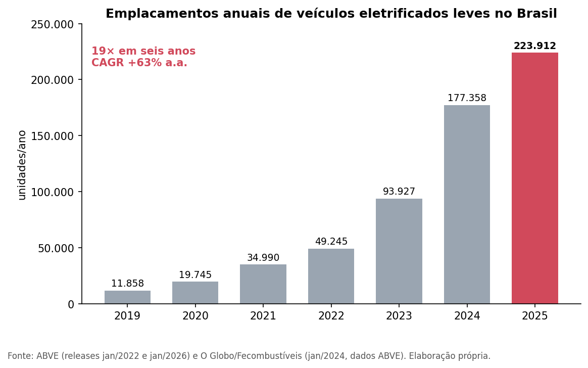
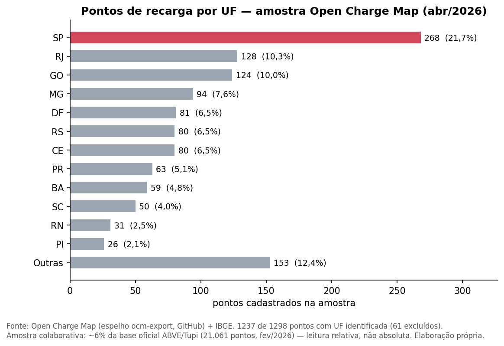
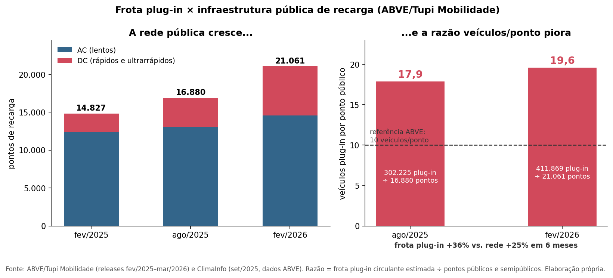
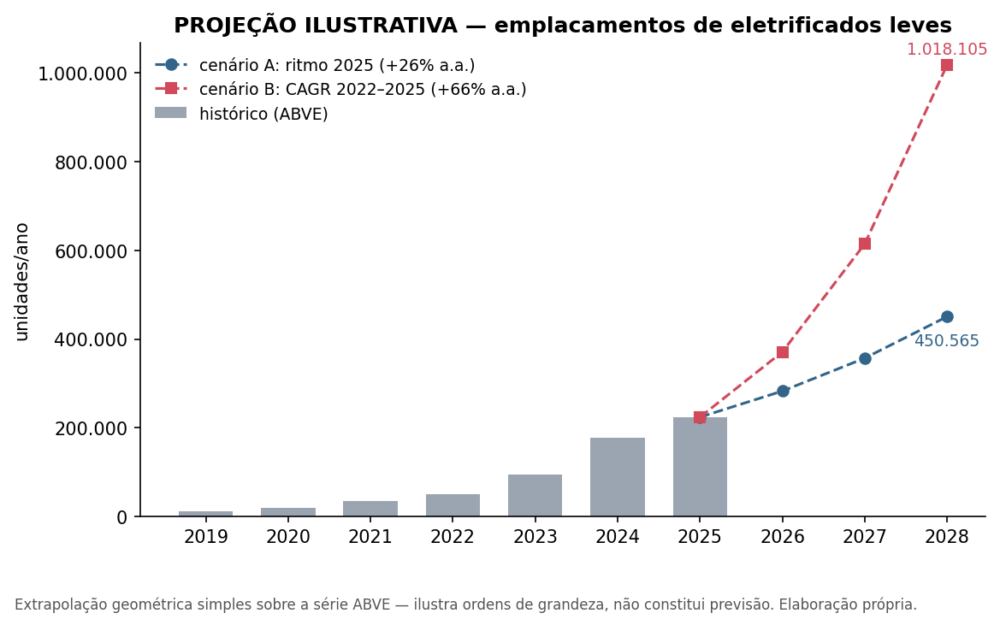

# Frente 1 — Contexto e Problema

## Recarga compartilhada e desafios operacionais

### Contexto: a frota eletrificada cresce mais rápido que a infraestrutura de gestão

O Brasil fechou 2025 com 223.912 veículos eletrificados leves vendidos — recorde histórico e crescimento de 26% sobre 2024, dez vezes acima do mercado total (que cresceu 2,6%). Desses, 181.542 são plug-in (PHEV + BEV), ou seja, veículos que efetivamente dependem de tomada [ABVE, 2026]. Como a recarga cotidiana de um EV acontece majoritariamente onde o carro dorme, esse crescimento empurra o problema para dentro de condomínios residenciais, estacionamentos corporativos e campi — ambientes onde a energia é compartilhada, mas o consumo é individual.

### Os desafios do gestor

A literatura de mercado e a cobertura especializada convergem em um conjunto recorrente de dores de quem administra esses espaços:

1. **Limite de potência da instalação.** Um EV em recarga AC pode consumir o equivalente a um apartamento inteiro com todos os eletrodomésticos ligados. Edifícios antigos não foram dimensionados para recargas simultâneas, e a entrada de energia do condomínio é um teto físico: sem gerenciamento, poucas recargas concorrentes podem derrubar o quadro geral [MyCond, 2026; Power2Go, 2026].
2. **Rateio justo do consumo.** Quando o carregador é alimentado pela área comum, sem medição individualizada o custo da energia de poucos moradores é diluído na taxa condominial de todos — fonte direta de conflito em assembleia. A orientação dominante é que "a energia deve ser individualizada, evitando subsídios entre usuários e não usuários" [Lello Condomínios, 2026].
3. **Disputa por carregadores compartilhados.** Quando a avaliação de carga conclui que só cabem um ou dois pontos coletivos, surge o problema de fila: tempo máximo de uso, agendamento, veículo que termina a recarga e continua ocupando a vaga. "Gerenciar a disponibilidade dos carregadores compartilhados pode se tornar complicado" à medida que a frota interna cresce [Power2Go, 2026].
4. **Segurança e conformidade técnica.** A instalação exige laudo elétrico, ART de engenheiro habilitado e aderência às normas ABNT NBR 5410, NBR 17019 e NBR IEC 61851-1; em São Paulo, o Corpo de Bombeiros atualizou a IT-41 em novembro de 2025 com requisitos específicos para sistemas de alimentação de veículos elétricos (S.A.V.E.) [Lello Condomínios, 2026]. O síndico responde legalmente pela conformidade.
5. **Governança e vácuo normativo.** A Lei estadual paulista nº 18.403/2026 garantiu ao condômino o direito de instalar ponto de recarga na vaga privativa às suas expensas, invertendo a lógica anterior (a negativa agora exige laudo técnico fundamentado). Mas a própria lei silencia sobre rateio de obras coletivas, vagas rotativas e impactos da instalação individual na capacidade futura dos demais — lacunas que recaem sobre o gestor [Migalhas, 2026].

### Análise da equipe

O padrão que emerge dessas fontes é claro: o gargalo não é mais o hardware (carregadores AC residenciais são commodity), e sim a **camada de gestão** — quem usou, quanto usou, quanto deve, quem carrega agora e quanto a instalação aguenta. A Lei 18.403/26 acelera a adoção (facilita instalar) sem resolver a operação (não diz como gerir), ampliando exatamente a lacuna que o EV ChargeOps ataca: sessões identificadas por usuário, kWh individual medido, rateio automático e auditável, e gestão de disponibilidade. O síndico responde legalmente pela conformidade da instalação. Dessa exigência legal decorre um requisito de produto pouco óbvio: relatórios exportáveis que sirvam de prestação de contas em assembleia.

## Anatomia técnica de uma sessão de recarga

Entender o que acontece entre "plugar o cabo" e "receber a conta" é pré-requisito para projetar a plataforma: cada etapa do ciclo gera eventos e medições que são a matéria-prima do EV ChargeOps.

### Ciclo de vida de uma sessão (recarga AC, Modo 3)

1. **Plug-in e detecção.** O conector é inserido. O carregador (EVSE) detecta a presença do veículo pelo circuito *Control Pilot* (CP): o veículo altera a resistência entre CP e terra, sinalizando os estados padronizados — A (sem veículo), B (veículo detectado), C (pronto para carregar) [Wikipedia/SAE J1772, acesso 2026].
2. **Negociação de corrente.** A norma IEC 61851 define quatro modos de carga (Modo 1: tomada comum sem controle; Modo 2: cabo com proteção embarcada; Modo 3: carregador AC dedicado com sinalização completa; Modo 4: recarga DC com carregador externo) [Monta, 2026]. No Modo 3, o carregador gera no CP uma onda quadrada de 1 kHz a ±12 V, e o *duty cycle* do PWM codifica a corrente máxima permitida (ex.: 25% ≈ 16 A, 50% ≈ 32 A) [Wikipedia/SAE J1772, acesso 2026]. É por esse mecanismo que sistemas de balanceamento de carga reduzem dinamicamente a corrente de cada vaga quando o prédio se aproxima do limite.
3. **Autenticação e autorização.** Quem paga precisa ser identificado antes de liberar energia. Os métodos usuais: cartão RFID encostado no leitor, aplicativo (QR code ou seleção do ponto) ou, nos sistemas mais novos, **Plug & Charge** da ISO 15118 — o veículo e o carregador trocam certificados digitais e a autenticação acontece automaticamente ao conectar o cabo, sem nenhuma ação do motorista [Wikipedia/ISO 15118, acesso 2026]. A ISO 15118 define a camada de comunicação digital de alto nível (identificação segura, smart charging, V2G) que opera sobre a base elétrica da IEC 61851.
4. **Energização e medição contínua.** Autorizada a sessão, o contator fecha e a energia flui. O medidor embarcado registra continuamente energia acumulada (kWh), potência instantânea (kW), corrente, tensão e duração. Em equipamentos voltados a cobrança, a medição é certificada (ex.: MID na Europa, citada pela Zaptec como base de faturamento) [Zaptec, 2026].
5. **Encerramento.** A sessão termina por bateria cheia, desconexão do cabo, comando remoto ou regra de negócio (tempo máximo). O carregador registra o motivo do encerramento e a leitura final do medidor.
6. **Registro e cobrança.** O consumo da sessão (kWh entre leitura inicial e final), atribuído ao usuário autenticado, vira o lançamento de cobrança ou rateio.

### Como os eventos chegam ao software: OCPP

O elo entre o carregador e a plataforma de gestão é o **OCPP (Open Charge Point Protocol)**, padrão aberto mantido pela Open Charge Alliance que permite que carregadores de diferentes fabricantes se integrem a sistemas de outros fornecedores [CanalVE, 2026]. Na versão 1.6J (a mais difundida), a comunicação é JSON sobre WebSocket e o ciclo acima se materializa em mensagens [OCPP.md, 2026]:

- `BootNotification` / `Heartbeat` — o carregador se apresenta ao sistema central e mantém keepalive;
- `Authorize` — envia o `idTag` (credencial RFID/app) para validação;
- `StartTransaction` — abre a sessão com conector, idTag, leitura inicial do medidor e timestamp; o sistema central devolve o `transactionId`;
- `MeterValues` — telemetria periódica durante a recarga (energia, potência, tensão, corrente), em intervalo configurável;
- `StopTransaction` — fecha a sessão com leitura final, timestamp e motivo do encerramento;
- `StatusNotification` — transições de estado do conector (Preparing, Charging, Finishing, Available).

No OCPP 2.0.1, esse fluxo é consolidado na mensagem única `TransactionEvent` (Started/Updated/Ended). A alternativa ao OCPP são APIs proprietárias de fabricante — caminho que cria *lock-in*, como se verá na análise da Zaptec na Opção A. A interoperabilidade via protocolos abertos é tema da agenda regulatória brasileira de recarga e será aprofundada na Frente 2.

### Análise da equipe

Para o EV ChargeOps, a consequência prática é direta: **o modelo de dados da plataforma já está praticamente desenhado pelo OCPP**. Uma "sessão" no nosso domínio mapeia 1:1 para o trio StartTransaction → MeterValues → StopTransaction, com usuário (idTag), ponto (connectorId), energia (meterStart/meterStop) e linha do tempo de potência. Projetar as entidades internas espelhando esse vocabulário garante compatibilidade com qualquer carregador OCPP e evita dependência de fabricante. Além disso, os `MeterValues` periódicos são o insumo natural da camada de IA operacional (detecção de anomalia de consumo, previsão de pico, sugestão de janelas de recarga) — sem custo adicional de instrumentação, pois o protocolo já entrega a telemetria.

## Modelos de negócio

### Base regulatória: preço livre

No Brasil, a recarga de veículos elétricos é atividade liberada a qualquer interessado, "inclusive para fins de exploração comercial com preços livremente negociados". A regra foi inaugurada pela REN ANEEL 819/2018 e hoje está consolidada no capítulo V da REN ANEEL 1.000/2021, que a revogou. A ANEEL adota regulação mínima: protege a rede elétrica e os demais consumidores, mas não tabela o preço da recarga [ANEEL, 2026]. Isso significa que o modelo de monetização é decisão de produto, não imposição regulatória — e o mercado pratica todos os formatos abaixo.

### Os cinco modelos praticados

1. **Gratuito (recarga como amenidade).** Comum em shoppings e supermercados, que usam o carregador como diferencial para atrair clientes [GreenV, 2026]. O "pagamento" é indireto: tempo de permanência e fidelização. Em condomínios, equivale a diluir o custo na taxa condominial — exatamente o cenário de rateio injusto descrito na seção de desafios.
2. **Por kWh (paga-se a energia).** O usuário paga proporcionalmente à energia recebida. Não existe preço nacional de referência; cada eletroposto define o seu, variando por rede e localidade [Carregados, 2026]. É o modelo mais justo do ponto de vista de consumo, mas não desincentiva o "carro-tampão" que termina a recarga e segue ocupando a vaga.
3. **Por tempo (paga-se a ocupação).** O usuário paga por minuto conectado. Exemplo real: a rede pública da Copel no Paraná cobra de R$ 0,44/min a R$ 5,82/min conforme a potência do carregador (22, 60 ou 150 kW) [Governo do Paraná, 2025]. Resolve a ocupação ociosa, mas penaliza veículos que carregam mais devagar (pagam mais pelos mesmos kWh).
4. **Assinatura/plano.** Mensalidade fixa com acesso à rede ou franquia de recargas [GreenV, 2026]. Frequentemente combinada com tarifas por uso (modelo híbrido). A interoperabilidade entre redes — como a parceria Zletric + VoltBras, que unificou cadastro e pagamento em mais de 2.500 eletropostos [Zletric, 2026] — aumenta o valor percebido da assinatura.
5. **Rateio condominial.** Específico do contexto compartilhado: a plataforma mede o kWh de cada morador e fecha uma "fatura" mensal individual, que entra no boleto do condomínio ou é cobrada diretamente. É o modelo da NeoCharge para prédios ("mede quanto cada morador utilizou de energia e depois faz a divisão ao final de cada mês") [NeoCharge, 2026] e da ChargePoint nos EUA, que fatura o morador diretamente e reembolsa o condomínio pelo custo da energia [ChargePoint, 2026].

Modelos mistos são comuns: taxa de ativação + kWh, kWh + multa de ociosidade após o fim da recarga, assinatura + tarifa reduzida.

### Análise da equipe

Para o EV ChargeOps, a lição central é que **o motor de tarifação precisa ser configurável, não fixo**: o mesmo condomínio pode querer kWh puro para moradores, tarifa por tempo para visitantes e multa de ociosidade nos horários de pico — e a regulação brasileira permite tudo isso. O modelo 5 (rateio) é o menos atendido por soluções genéricas e o mais aderente ao nosso público; os modelos 2 e 3 mostram que a plataforma deve registrar tanto kWh quanto duração de ocupação por sessão (dados que o OCPP já fornece), permitindo compor tarifas híbridas. Há ainda uma oportunidade analítica: com dados de sessão por usuário, a plataforma pode simular para o síndico quanto cada modelo arrecadaria antes de adotá-lo — uma funcionalidade de decisão que nenhuma das soluções mapeadas na Opção A oferece.

## Opção A — Análise de mercado

Mapeamos quatro soluções existentes que tangenciam o problema do EV ChargeOps, escolhidas por cobrirem quadrantes diferentes do mercado: hardware premium europeu para edifícios (Zaptec), plataforma global integrada (ChargePoint), player nacional de condomínios (NeoCharge) e rede pública de concessionária brasileira (Copel/Eletroposto Fácil).

### Zaptec (Noruega) — Zaptec Pro + Zaptec Portal

- **Problema que resolve:** recarga coletiva em prédios residenciais e associações habitacionais sem upgrade caro da entrada de energia.
- **Funcionalidades principais:** balanceamento dinâmico de carga e de fases patenteado (distribui a potência disponível entre os veículos sem sobrecarregar a instalação, alternando entre mono e trifásico por carro); escala de 2 a 1.000+ pontos; medição certificada MID para faturamento; gestão via Zaptec Portal na nuvem (gratuito); conectividade Wi-Fi/PLC/4G; autenticação por app e cartão [Zaptec, 2026].
- **Modelo de negócio:** venda de hardware (carregador + backplate de pré-instalação) com portal de gestão incluído sem mensalidade — o software é isca para o hardware [Zaptec, 2026].
- **Limitações:** o suporte a OCPP é parcial por desenho: no modo OCPP 1.6J direto, o carregador perde o balanceamento proprietário de carga/fases ("não inclui os recursos avançados proprietários de balanceamento"); no modo OCPP Cloud, o balanceamento fica, mas o smart charging via OCPP é bloqueado — a otimização energética permanece presa à nuvem da Zaptec [Zaptec Docs, 2026]. Ou seja: o melhor recurso do produto não funciona fora do ecossistema do fabricante. *Análise da equipe:* a empresa é focada no mercado europeu, sem canal oficial de operação no Brasil divulgado, e não oferece rateio condominial nos moldes brasileiros (boleto/assembleia).

### ChargePoint (EUA) — solução para condomínios e HOAs

- **Problema que resolve:** recarga residencial para quem mora em apartamento, com cobrança individual e sem custo de energia para o condomínio.
- **Funcionalidades principais:** hardware dedicado por cenário (CPF50 para vaga fixa de morador, CP6000 para vagas de visitantes, Home Flex para vaga com medidor próprio); *Power Sharing* para evitar upgrade elétrico; dashboard na nuvem com visibilidade em tempo real, consumo, emissões e custos; controle de acesso por grupo (morador/visitante); **cobrança direta ao morador com reembolso do custo de energia ao condomínio** [ChargePoint, 2026].
- **Modelo de negócio:** hardware + assinatura de software na nuvem (ChargePoint Cloud) + serviços de suporte/garantia. Em 2026 a empresa passou a cobrar também **taxa de serviço por sessão** do motorista (US$ 0,25–0,99), somada ao preço definido pelo dono do carregador [EV Connect, 2026].
- **Limitações:** as taxas por sessão de 2026 geraram reação negativa documentada — custos imprevisíveis para o motorista, desincentivo ao uso casual e risco de imagem para o anfitrião que anunciava recarga barata [EV Connect, 2026]. *Análise da equipe:* além do custo recorrente de assinatura por porta, a solução condominial completa não opera no Brasil; o fluxo de "reembolso ao condomínio" pressupõe o sistema bancário/imobiliário norte-americano e não conversa com a realidade de boleto condominial e convenção de condomínio brasileiras.

### NeoCharge (Brasil) — carregadores smart + Plataforma de Gestão de Recarga

- **Problema que resolve:** instalação e gestão de recarga em condomínios, empresas e eletropostos brasileiros, incluindo a divisão do consumo entre moradores.
- **Funcionalidades principais:** carregadores wallbox conectados; plataforma que registra cobranças por recarga, disponibilidade por carregador, recargas por conector e energia utilizada; controle remoto (reiniciar, desativar, interromper recarga); medição por usuário com rateio mensal ("mede quanto cada morador utilizou e faz a divisão ao final de cada mês"); app para o usuário final com histórico e acompanhamento [NeoCharge, 2026; NeoCharge Condomínios, 2026].
- **Modelo de negócio:** híbrido — venda de hardware próprio + assinatura da plataforma de gestão + serviços opcionais (instalação, manutenção, monitoramento) [NeoCharge, 2026].
- **Limitações:** *análise da equipe, por ausência de documentação pública em contrário:* o material institucional não documenta conformidade OCPP da plataforma de gestão nem abertura de API — o pacote pressupõe hardware da própria NeoCharge, configurando risco de lock-in vertical (quem já tem carregadores de outra marca não aproveita a plataforma); não há menção a funcionalidades de inteligência operacional (previsão de demanda, detecção de anomalias, otimização de janelas); preços não são públicos, dificultando comparação de TCO pelo síndico.

### Copel EV / Eletroposto Fácil (Brasil) — rede pública de concessionária

- **Problema que resolve:** ansiedade de autonomia em deslocamentos intermunicipais — rede pública de recarga ao longo de 1.246 km de "eletrovia" no Paraná, com 32 carregadores, incluindo unidade ultrarrápida de 150 kW em Curitiba [Governo do Paraná, 2025].
- **Funcionalidades principais:** app Eletroposto Fácil com mapa de carregadores, disponibilidade em tempo real, **reserva de conector**, acompanhamento da recarga com energia e custo em tempo real, histórico e estatísticas [App Store, 2026].
- **Modelo de negócio:** cobrança por tempo (R$ 0,44/min a R$ 5,82/min conforme a potência), com pagamento processado via app de parceiro (Lex Mobility) [Governo do Paraná, 2025]. Nasceu de programa de inovação aberta da concessionária (Copel Volt).
- **Limitações:** o app tem nota 3,8/5 na App Store, com reclamações de erro no cadastro, eletropostos fora de operação sem sinalização e falta de suporte local [App Store, 2026]. A cobrança por minuto penaliza veículos com carregador AC mais lento. *Análise da equipe:* é uma solução de corredor rodoviário, não de gestão compartilhada — não há noção de rateio, de grupo fechado de usuários nem de limite de potência predial; entra no mapa como referência de UX pública (reserva de conector é uma boa ideia importável) e como evidência de que disponibilidade/manutenção é o calcanhar de aquiles operacional de redes reais.

### Tabela comparativa

| Dimensão | Zaptec | ChargePoint | NeoCharge | Copel EV |
|---|---|---|---|---|
| **Problema que resolve** | Recarga coletiva em prédios europeus sem upgrade elétrico | Recarga em condomínios/HOAs com cobrança individual (EUA) | Recarga e rateio em condomínios e empresas brasileiras | Recarga pública em corredor rodoviário (PR) |
| **Funcionalidades principais** | Balanceamento dinâmico de carga/fases, portal cloud gratuito, medição MID, 2→1.000+ pontos | Power Sharing, dashboard cloud, cobrança direta ao morador + reembolso, perfis morador/visitante | Medição por usuário, rateio mensal, controle remoto de carregadores, app do usuário | Mapa + reserva de conector, recarga e custo em tempo real, 150 kW ultrarrápido |
| **Modelo de negócio** | Venda de hardware; software incluso | Hardware + assinatura cloud + taxa por sessão (2026) | Hardware + assinatura da plataforma + serviços | Cobrança por minuto (R$ 0,44–5,82/min), pagamento via app parceiro |
| **Limitações conhecidas** | OCPP parcial: balanceamento só na nuvem proprietária; sem operação no BR* | Taxas por sessão mal recebidas (2026); solução condominial não opera no BR* | Sem OCPP/API documentados → lock-in vertical*; preço não público* | App 3,8/5 com eletropostos inativos; cobrança por minuto penaliza AC lento |

\* Itens marcados derivam de análise da equipe sobre ausência de oferta/documentação pública, não de fonte que afirme a limitação.

### Análise da equipe — a lacuna que o EV ChargeOps ataca

Lendo as quatro soluções em conjunto, o mercado se divide em dois eixos: **excelência de hardware/energia** (Zaptec resolve o limite de potência melhor que todos, mas prende a inteligência na própria nuvem) e **excelência de operação comercial** (ChargePoint resolve a cobrança individual melhor que todos, mas a custo recorrente alto e fora do contexto jurídico brasileiro). O player nacional (NeoCharge) é o mais próximo do nosso problema, porém empacota gestão com hardware próprio e não exibe camada analítica. Nenhuma das quatro oferece, simultaneamente: (1) **rateio condominial nativo do Brasil** — integrado a boleto, assembleia e à realidade da Lei 18.403/26; (2) **neutralidade de hardware via OCPP** — funcionar com qualquer carregador compatível, evitando o lock-in que Zaptec e NeoCharge praticam por desenho; e (3) **IA operacional sobre a telemetria** — previsão de pico contra a demanda contratada, detecção de anomalia de consumo, sugestão de janelas e simulação de modelos tarifários. Essa interseção vazia é o posicionamento do EV ChargeOps. O contraexemplo da Copel acrescenta um alerta de execução: plataforma sem operação confiável (eletropostos inativos, suporte ausente) destrói a confiança do usuário mais rápido do que qualquer funcionalidade a constrói — monitoramento de saúde dos pontos (via Heartbeat/StatusNotification do OCPP) deve ser tratado como funcionalidade de primeira classe, não acessório.

## Opção B — Pesquisa com usuários
<!-- a preencher -->

## Opção C — Análise de dados públicos

Para testar com números o argumento central deste dossiê — a frota eletrificada cresce mais rápido do que a infraestrutura de recarga consegue acompanhar —, construímos uma análise quantitativa reproduzível em [`notebooks/frota_ev_brasil.ipynb`](../notebooks/frota_ev_brasil.ipynb). Três blocos de dados públicos: a série anual de emplacamentos da ABVE (transcrita manualmente dos releases oficiais, com a fonte de cada número comentada no código), as fotografias da rede pública de recarga da base ABVE/Tupi Mobilidade em três cortes temporais (fev/2025, ago/2025, fev/2026) e a base colaborativa Open Charge Map (1.298 pontos brasileiros, via espelho oficial `ocm-export` no GitHub) cruzada com a lista de municípios do IBGE. Os dados brutos ficam em `data/` e os gráficos são gerados pelo próprio notebook.

### A frota: 19× em seis anos, e cada vez mais dependente de tomada

Os emplacamentos anuais de eletrificados leves saltaram de 11.858 (2019) para 223.912 (2025) — fator de 18,9×, crescimento médio de +63% ao ano, contra +2,6% do mercado total em 2025 [ABVE, 2026]. Mais importante para o nosso problema: a composição mudou. A fatia plug-in (BEV+PHEV, os veículos que efetivamente dependem de tomada) era 41% das vendas em 2021, foi a 71% em 2024 e chegou a **81% em 2025** [ABVE, 2022; ABVE, 2026]. O crescimento da frota é, cada vez mais, crescimento direto de demanda por recarga.

### A rede pública: cresce rápido, mas é pequena e concentrada

A base nacional ABVE/Tupi Mobilidade registrava 14.827 pontos públicos e semipúblicos em fev/2025, 16.880 em ago/2025 e 21.061 em fev/2026 — +42% em doze meses, com os carregadores rápidos (DC) crescendo 167% [ABVE, 2026b; ClimaInfo, 2025]. A distribuição, porém, é desigual: São Paulo concentra 28,3% da rede oficial (4.777 pontos), e SP+RJ+RS+DF somam mais da metade [AutoIndústria, 2026]; apenas 1.649 dos 5.571 municípios brasileiros (29,6%) têm algum ponto público [ABVE, 2026b]. Nossa agregação autoral da amostra Open Charge Map (1.237 pontos com UF identificada, recuperando a UF pelo município via IBGE quando o campo de estado vinha vazio) confirma o padrão na mesma direção: SP com 21,7%, SP+RJ+RS+DF com 45% e o Norte inteiro com 1,6% da amostra.

### O gráfico-argumento: mesmo no melhor semestre da rede, a frota correu mais

Entre ago/2025 e fev/2026 — o período de expansão mais rápida da história da rede pública — a frota plug-in circulante cresceu +36% (302.225 → 411.869 veículos) enquanto os pontos públicos cresceram +25% (16.880 → 21.061). Resultado: a razão **veículos plug-in por ponto público piorou de 17,9 para 19,6**, praticamente o dobro da referência de 10:1 que a própria ABVE adota como rede adequada [ABVE, 2026b; ClimaInfo, 2025]. Numerador e denominador explícitos: frota plug-in acumulada estimada ÷ pontos públicos e semipúblicos cadastrados — a razão não mede recarga residencial privada; mede a pressão sobre a infraestrutura compartilhada.

### Projeção ilustrativa: a pressão só aumenta

Uma extrapolação geométrica simples — claramente ilustrativa, não previsão — dimensiona o que vem: mantido apenas o ritmo de 2025 (+26% a.a., o mais lento da série), entram ~283 mil eletrificados novos em 2026 e ~451 mil/ano em 2028; no ritmo do triênio 2022–2025 (+66% a.a.), seriam ~371 mil em 2026 e mais de 1 milhão/ano em 2028. Usamos dois cenários justamente para delimitar a banda de possibilidades em vez de apostar numa trajetória única: o caminho real depende de variáveis exógenas — câmbio, tarifas de importação, política industrial e a própria expansão da infraestrutura —, mas a ordem de grandeza é inequívoca em qualquer ponto da banda.

**Limitações declaradas:** ABVE/Tupi não publicam dataset estruturado (números transcritos de releases, conferidos contra duas fontes quando disponível); o Open Charge Map é colaborativo e cobre ~6% da base oficial (usado só para distribuição relativa, validada contra a oficial); os cortes temporais de frota e rede não coincidem perfeitamente; a projeção não modela variáveis exógenas. Detalhes no notebook.

### Análise da equipe

Os números fecham o argumento que as seções qualitativas vinham construindo. Primeiro, a demanda por recarga cresce mais rápido que a oferta pública mesmo no melhor momento da rede — e a razão de 19,6 veículos/ponto (quase 2× o referencial) significa fila, ocupação e inconveniência crescentes para quem depende de eletroposto. Segundo, a rede pública é geograficamente concentrada: fora de SP/RJ/RS/DF e fora das capitais, ela é rarefeita — 70% dos municípios não têm um único ponto. Terceiro, 81% dos veículos eletrificados vendidos hoje dependem de tomada. A consequência lógica das três curvas é que a recarga cotidiana recai sobre o lugar onde o carro dorme: a garagem do condomínio, do quartel, da empresa. É a quantificação da premissa do EV ChargeOps — a infraestrutura compartilhada privada vira o amortecedor do déficit público, e ela chega a esse papel **sem nenhuma camada de gestão**: sem medição por usuário, sem rateio auditável, sem fila organizada, sem controle do limite de potência predial (as dores da seção de desafios). Cada ponto da razão 19,6 que a rede pública não resolve é demanda empurrada para dentro do condomínio — e, portanto, para a plataforma que propomos.

## Fontes

### Frente 1 — corpo e Opção A

Todas as fontes abaixo foram acessadas e verificadas em 2026-06-09.

**Contexto e desafios operacionais**

1. ABVE — "Eletrificados crescem dez vezes mais do que o conjunto do mercado, e vendas chegam a 224 mil veículos em 2025". https://abve.org.br/eletrificados-crescem-dez-vezes-mais-do-que-conjunto-do-mercado-em-2025-com-224-mil-veiculos-vendidos/
2. Migalhas — "Lei 18.403/26 de SP: Recarga de veículos elétricos em condomínios". https://www.migalhas.com.br/coluna/migalhas-edilicias/452093/lei-18-403-26-de-sp-recarga-de-veiculos-eletricos-em-condominios
3. MyCond — "Desafios para Carregadores de Carros Elétricos em Condomínios". https://mycond.com.br/desafios-para-carregadores-de-carros-eletricos-em-condominios/
4. Lello Condomínios — "Veículos elétricos em condomínios: o que diz a legislação". https://www.lellocondominios.com.br/veiculos-eletricos-em-condominios-o-que-diz-a-legislacao-como-instalar-e-quais-cuidados-os-sindicos-precisam-ter/
5. Power2Go — "Condomínios: carregadores individuais ou compartilhados?". https://www.power2go.com.br/post/condom%C3%ADnios-carregadores-individuais-ou-compartilhados

**Anatomia técnica da sessão**

6. Monta — "IEC 61851: Definition, scope, and role in EV charging". https://monta.com/en/blog/iec-61851/
7. Wikipedia — "SAE J1772" (sinalização Control Pilot/PWM compartilhada com IEC 61851 Modo 3). https://en.wikipedia.org/wiki/SAE_J1772
8. Wikipedia — "ISO 15118" (Plug & Charge, V2G). https://en.wikipedia.org/wiki/ISO_15118
9. OCPP.md — "OCPP 1.6J — Open Charge Point Protocol (JSON over WebSocket)". https://ocpp.md/ocpp-1.6j/
10. CanalVE — "Como funciona o protocolo OCPP na recarga de carros elétricos?". https://canalve.com.br/como-funciona-o-protocolo-ocpp-nas-recargas-de-carros-eletricos/

**Modelos de negócio**

11. ANEEL — "Veículos Elétricos" (REN 819/2018 e REN 1.000/2021, preços livremente negociados). https://www.gov.br/aneel/pt-br/assuntos/veiculos-eletricos
12. Carregados — "Quanto custa para carregar um carro elétrico no Brasil?". https://carregados.com.br/quanto-custa-para-carregar-um-carro-eletrico
13. GreenV — "Eletroposto: o que é, como funciona e quanto custa abastecer". https://www.greenv.com.br/blog/eletroposto-o-que-e-como-funciona-e-quanto-custa-abastecer/
14. Zletric — "Zletric e VoltBras criam rede com mais de 2.500 eletropostos interoperáveis no Brasil". https://www.zletric.com.br/post/zletric-e-voltbras-criam-rede-com-mais-de-2500-eletropostos-interoperaveis-no-brasil

**Opção A — soluções analisadas**

15. Zaptec — "Zaptec Pro". https://www.zaptec.com/charging-solutions/business-and-commercial/zaptec-pro
16. Zaptec Docs — "OCPP within Zaptec". https://docs.zaptec.com/docs/ocpp-within-zaptec
17. ChargePoint — "EV Charging Solutions for Condo Managers and HOAs". https://www.chargepoint.com/solutions/condos
18. EV Connect — "New ChargePoint Fees: What's Changing and Who Pays More". https://www.evconnect.com/blog/chargepoint-raises-fees-in-2026/
19. NeoCharge — "Plataforma de Gestão de Recarga". https://www.neocharge.com.br/plataforma-gestao-recarga
20. NeoCharge — "Carregador para Carro Elétrico em Prédios e Condomínios". https://www.neocharge.com.br/tudo-sobre/carregador-carro-eletrico-predio-condominio-instalacao
21. Governo do Paraná (AEN) — "Copel coloca em operação seu primeiro eletroposto com carregador ultrarrápido". https://www.parana.pr.gov.br/aen/Noticia/Copel-coloca-em-operacao-seu-primeiro-eletroposto-com-carregador-ultrarrapido
22. App Store — "Eletroposto Fácil" (Copel). https://apps.apple.com/br/app/eletroposto-f%C3%A1cil/id1610189111

### Opção C — análise de dados públicos

Todas as fontes abaixo foram acessadas em 2026-06-09. Citações no texto: [ABVE, 2026] = fonte 23; [ABVE, 2026b] = fonte 25; [ABVE, 2022] = fonte 24.

23. ABVE — "Eletrificados crescem dez vezes mais do que o conjunto do mercado, e vendas chegam a 224 mil veículos em 2025" (emplacamentos 2025/2024/2016 e divisão BEV/PHEV/HEV; mesma fonte 1). https://abve.org.br/eletrificados-crescem-dez-vezes-mais-do-que-conjunto-do-mercado-em-2025-com-224-mil-veiculos-vendidos/
24. ABVE — "Eletrificados batem todas as previsões em 2021" (emplacamentos 2019–2021 e divisão por tecnologia em 2021). https://abve.org.br/eletrificados-batem-todas-as-previsoes-em-2021/
25. ABVE — "Recarga pública rápida cresce 167% em um ano e chega a 31% dos 21 mil eletropostos da rede" (rede fev/2025 e fev/2026 com divisão AC/DC, municípios por região, frota plug-in de 411.869, razão 19,6 veículos/ponto e referência 10:1). https://abve.org.br/recarga-publica-rapida-cresce-167-em-12-meses-e-ja-atinge-31-dos-21-mil-eletropostos-da-rede/
26. Fecombustíveis (reprodução de O Globo, 04/01/2024) — "Venda de carros eletrificados no Brasil cresce 91% em 2023 e atinge 93,9 mil emplacamentos" (emplacamentos 2022 e 2023, dados ABVE). https://www.fecombustiveis.org.br/noticia/venda-de-carros-eletrificados-no-brasil-cresce-91-em-2023-e-atinge-939-mil-emplacamentos/255655
27. ClimaInfo — "Pontos de recarga de VEs crescem 59% no Brasil, mas distribuição é desigual" (rede ago/2025 de 16.880 pontos e frota plug-in de 302.225, dados ABVE/Tupi). https://climainfo.org.br/2025/09/18/pontos-de-recarga-de-ves-crescem-59-no-brasil-mas-distribuicao-e-desigual/
28. Latam Mobility — "O Brasil alcança 16.880 pontos de recarga públicos e semipúblicos" (divisão AC/DC em 31/08/2025). https://latamobility.com/pt-br/o-brasil-alcanca-16-880-pontos-de-recarga-publicos-e-semipublicos-para-veiculos-eletricos/
29. AutoIndústria — "A nova geografia da recarga elétrica no Brasil" (SP com 4.777 pontos, 28,3%; SP+RJ+RS+DF com mais da metade da rede). https://www.autoindustria.com.br/2026/02/24/a-nova-geografia-da-recarga-eletrica-no-brasil/
30. Open Charge Map — espelho oficial `ocm-export` no GitHub (1.298 pontos de recarga no Brasil, georreferenciados; a API oficial exige chave gratuita, o espelho não). https://github.com/openchargemap/ocm-export
31. IBGE — API de localidades, lista oficial dos 5.571 municípios com UF e região. https://servicodados.ibge.gov.br/api/v1/localidades/municipios?view=nivelado
