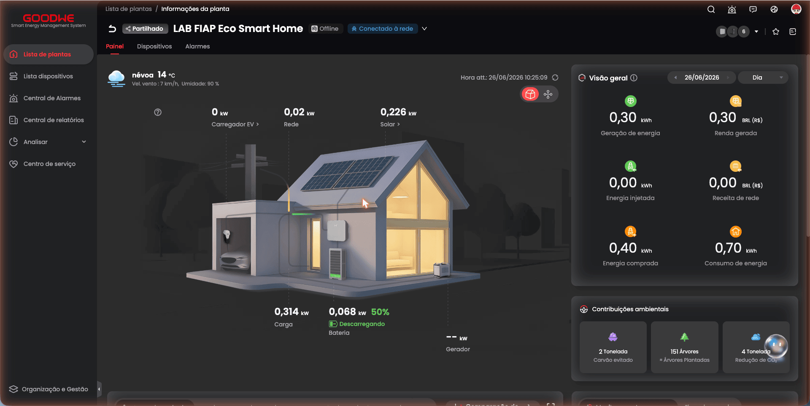
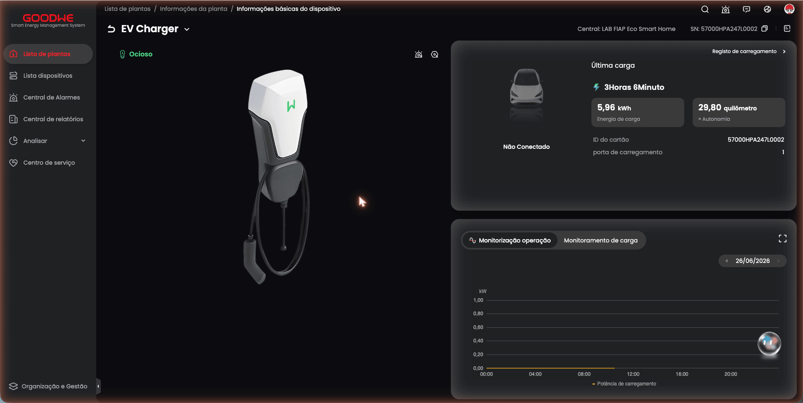
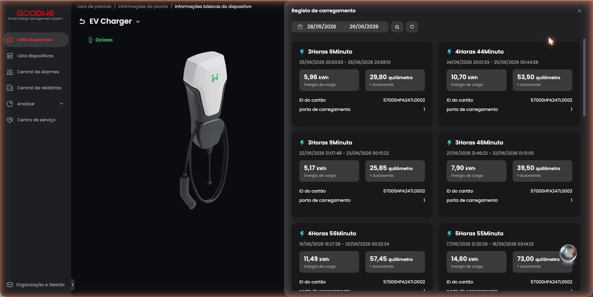
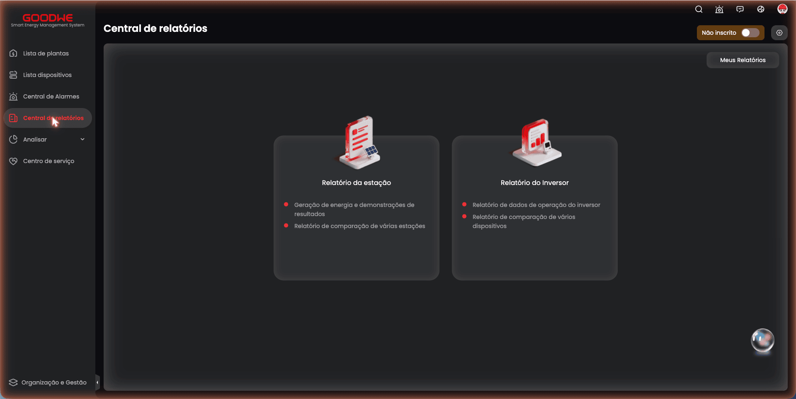

# Anexo Frente 2 — Acesso direto à plataforma SEMS+ (evidência [O])

> **Nível de evidência [O] — observação de primeira mão da equipe.** Este anexo registra o que a equipe observou ao navegar diretamente a plataforma de monitoramento **SEMS+** (`https://semsplus.goodwe.com`), com acesso de monitoramento à planta real do Energy Innovation Lab da FIAP, concedido pela GoodWe à conta da equipe em **26/06/2026**. Complementa a seção "API GoodWe SEMS Portal e plataforma SEMS+" de [`frente-2-regulatorio.md`](frente-2-regulatorio.md), que resume os achados; aqui ficam o inventário bruto de endpoints e o histórico de sessões na íntegra.

## Contexto do acesso

| Item | Valor observado |
|---|---|
| Plataforma | SEMS+ web (`semsplus.goodwe.com`) — front-end do SEMS Portal |
| Planta | "LAB FIAP Eco Smart Home" (tipo residencial / maquete de laboratório) |
| `stationId` (`pwId`) | `7f9af1fc-3a9a-4779-a4c0-ca6ec87bd93a` |
| Carregador | GoodWe HCA G2, `deviceType = EV_CHARGER` |
| Número de série (`SN` / `chargeSn`) | `57000HPA247L0002` |
| Estado no momento da visita | Planta **Offline**; carregador **Ocioso**, **Não Conectado** |
| Vínculo da conta | Planta **compartilhada** com a conta da equipe (não é ativo próprio da organização "GoodNóis") |
| Data da sessão de exploração | 26/06/2026 |

**Como a evidência foi coletada.** A equipe navegou a interface web autenticada e leu, no **painel de rede do navegador**, as requisições XHR/Fetch que o front-end faz ao backend (URL, método HTTP e código de status), além dos valores **renderizados na tela**. Não houve inspeção dos corpos de resposta JSON nem chamada autenticada fora do fluxo normal da própria interface — a equipe apenas observou o que a aplicação já fazia ao ser usada.

**Ressalvas de honestidade.**
1. A planta é **residencial de demonstração**, não um condomínio em operação — a evidência vale como **forma do dado** (quais campos existem, como se organizam), não como amostra de uso condominial real.
2. Os campos abaixo vêm de **rótulos da UI** e de **URLs/métodos** capturados, não dos esquemas JSON brutos — nomes internos de campo podem diferir do rótulo exibido.
3. Este é o contrato da **API web privada** (gateway `us-gateway.semsportal.com`), **distinto** da API privada do app Android (`semsPlusAndroid`, `/api/v3/EvCharger/...`) documentada pela comunidade (nível [B]) e **distinto** da OpenAPI oficial de desenvolvedor (credenciada, B2B), que permanece indisponível às equipes. Trata-se de API privada, sujeita a mudança sem aviso.

## Inventário de endpoints observados

Todos sob `https://us-gateway.semsportal.com`, capturados ao abrir a planta e a tela do carregador (HTTP 200 salvo nota). Microsserviços identificados pelo caminho: `sems-plant`, `sems-remote`, `sems-alarm`, `sems-user`, `sems-sitemsg`. `{SN}` = `57000HPA247L0002`; `{pwId}` = `7f9af1fc-3a9a-4779-a4c0-ca6ec87bd93a`.

### Específicos do carregador EV

| Método | Caminho | Função observada |
|---|---|---|
| POST | `/web/sems/sems-plant/api/v1/chargePile/queryChargeLogList` | **Histórico de sessões encerradas** (lista por intervalo de datas) |
| GET | `/web/sems/sems-plant/api/v1/chargePile/getLastCharge?chargeSn={SN}&pwId={pwId}` | Resumo da última sessão de recarga |
| POST | `/web/sems/sems-remote/api/ev-charger/detail` | Estado atual do carregador (ocioso / conectado) |
| GET | `/web/sems/sems-plant/api/equipments/{SN}/information?deviceType=EV_CHARGER&pwId={pwId}` | Identificação do equipamento (modelo, firmware, SN) |
| GET | `/web/sems/sems-plant/api/equipments/{SN}/telecounting?deviceType=EV_CHARGER&pwId={pwId}` | Contadores acumulados (telemetria totalizada) |
| POST | `/web/sems/sems-plant/api/portal/equipments/{SN}/timeSeriesData` | Séries temporais das curvas do dia (kW e kWh) |
| GET | `/web/sems/sems-plant/api/equipments/{SN}/getMetricConfig?pwId={pwId}&module=chart&sn={SN}&deviceType=EV_CHARGER` | Configuração de métricas dos gráficos |
| GET | `/web/sems/sems-remote/api/v2/address/remote/get-work-mode?sn={SN}` | **Leitura** do modo de carga (Fast / prioridade solar / …) |
| POST | `/web/sems/sems-remote/api/v2/address/remote/get-related-sn` | Resolução de SN relacionados |
| POST | `/web/sems/sems-remote/api/v2/address/remote/getAllDeviceFunctionTabs` | Abas de função disponíveis do dispositivo |
| GET | `/web/sems/sems-remote/api/ev-charger/control-item-content-list/{SN}` | Itens de controle remoto disponíveis |
| GET | `/web/sems/sems-plant/api/web/device/station/getDevicesByType?stationId={pwId}&deviceType=EV_CHARGER` | Lista de carregadores da planta |

### Planta, alarme e usuário (contexto, não específicos de recarga)

| Método | Caminho | Função observada |
|---|---|---|
| POST | `/web/sems/sems-plant/api/portal/stations/basic/info?stationId={pwId}` | Informações básicas da planta |
| POST | `/web/sems/sems-plant/api/stations/simple-query` | Consulta simples de plantas |
| GET | `/web/sems/sems-plant/api/web/device/has-device` | Verifica se há dispositivos |
| GET | `/web/sems/sems-plant/api/second-data/config` e `/second-data/enable?stationId={pwId}` | Configuração de dados em tempo (quase) real |
| POST | `/web/sems/sems-alarm/api/alarm/statistics` e `/alarm/count` | Estatísticas e contagem de alarmes |
| GET | `/web/sems/sems-user/api/v1/user/get-user` | Dados do usuário autenticado |
| POST | `/web/sems/sems-remote/api/v1/firmware-management/exist-remind` | Lembrete de firmware disponível |
| GET | `/web/sems/sems-remote/api/v1/ai-chat/common-question` | Perguntas comuns do assistente |
| GET/PUT | `/sems/sems-sitemsg/api/sse/subscribe/{userId}` e `/sse/heartbeat/{userId}` | Canal SSE de notificações (tempo real) |

## Telemetria e estrutura observadas na tela do dispositivo

- **Cabeçalho:** `EV Charger` · Central: `LAB FIAP Eco Smart Home` · `SN: 57000HPA247L0002` · estado **Ocioso**.
- **Painel "Última carga":** duração `3Horas 6Minuto`, `5,96 kWh` (Energia de carga), `29,80 quilômetro` (≈ Autonomia), **Não Conectado**, `ID do cartão: 57000HPA247L0002`, `porta de carregamento: 1`.
- **Abas de gráfico:** "Monitorização operação" (curva de **potência**, kW) e "Monitoramento de carga" (curva de **energia**, kWh, com três séries: **Carregamento de energia verde**, **Carregamento de rede** e **Energia de carga**).
- **Menu lateral da plataforma:** Lista de plantas · Lista dispositivos · Central de Alarmes · Central de relatórios · Analisar · Centro de serviço · Organização e Gestão.
- **Central de relatórios:** apenas "Relatório da estação" (Estatístico / Operacional) e "Relatório do inversor" — **nenhum relatório de carregador EV**; escopo por organização (a planta compartilhada da FIAP não aparece como ativo selecionável).

**Nota sobre a autonomia.** O valor "≈ Autonomia" é **derivado por fator fixo de ≈ 5,0 km/kWh** (29,80 ÷ 5,96 = 5,00; 73,00 ÷ 14,60 = 5,00; idem em todas as sessões) — é estimativa de UI, não telemetria de consumo do veículo. Pequenas divergências de centésimo (ex.: a sessão #18 exibe 71,44 km, e não 71,45 = 14,29 × 5) são arredondamento de exibição sobre um kWh interno mais preciso que o mostrado.

## Histórico de sessões encerradas (`queryChargeLogList`)

> Registro da coleta de 26/06/2026, transcrito da tela. A coleta de 22/09/2026, lida do JSON e com 72 sessões, está na seção seguinte.

Intervalo consultado na tela "Registo de carregamento": **28/05/2026 → 26/06/2026**. 18 sessões retornadas. Em todas, `ID do cartão` = `57000HPA247L0002` (o próprio SN — assinatura de **auto-start**, partida sem cartão) e `porta de carregamento` = `1`.

| # | Início | Fim | Duração | Energia (kWh) | ≈ Autonomia (km) |
|---|---|---|---|---|---|
| 1 | 25/06/2026 20:53:03 | 25/06/2026 23:58:51 | 3h06 | 5,96 | 29,80 |
| 2 | 24/06/2026 20:01:33 | 25/06/2026 00:44:28 | 4h44 | 10,70 | 53,50 |
| 3 | 22/06/2026 21:07:48 | 23/06/2026 00:15:22 | 3h09 | 5,17 | 25,85 |
| 4 | 21/06/2026 21:46:22 | 22/06/2026 01:31:00 | 3h46 | 7,90 | 39,50 |
| 5 | 19/06/2026 19:27:28 | 20/06/2026 00:22:24 | 4h56 | 11,49 | 57,45 |
| 6 | 17/06/2026 21:20:26 | 18/06/2026 03:14:22 | 5h55 | 14,60 | 73,00 |
| 7 | 15/06/2026 20:56:59 | 16/06/2026 00:05:21 | 3h10 | 6,09 | 30,45 |
| 8 | 14/06/2026 20:11:10 | 14/06/2026 20:47:34 | 0h37 | 0,00 | 0,00 |
| 9 | 13/06/2026 23:12:09 | 14/06/2026 02:20:48 | 3h09 | 5,71 | 28,55 |
| 10 | 12/06/2026 21:33:49 | 13/06/2026 02:13:38 | 4h41 | 10,75 | 53,75 |
| 11 | 10/06/2026 22:37:22 | 11/06/2026 00:31:19 | 1h55 | 2,34 | 11,70 |
| 12 | 10/06/2026 21:23:01 | 10/06/2026 22:33:03 | 1h11 | 3,53 | 17,65 |
| 13 | 09/06/2026 21:00:48 | 10/06/2026 01:48:28 | 4h49 | 11,24 | 56,20 |
| 14 | 07/06/2026 16:47:24 | 07/06/2026 21:15:24 | 4h29 | 9,61 | 48,05 |
| 15 | 05/06/2026 10:27:16 | 05/06/2026 13:11:04 | 2h45 | 4,57 | 22,85 |
| 16 | 03/06/2026 21:05:17 | 04/06/2026 00:32:29 | 3h28 | 7,11 | 35,55 |
| 17 | 01/06/2026 21:48:53 | 02/06/2026 00:49:51 | 3h02 | 5,60 | 28,00 |
| 18 | 31/05/2026 19:10:47 | 01/06/2026 00:59:13 | 5h50 | 14,29 | 71,44 |

**Total no período:** ≈ 136,66 kWh em 18 sessões (média ≈ 7,6 kWh/sessão). Padrões úteis para a Sprint 2:

- **Sessão de 0 kWh** (#8, 37 min): conexão sem entrega de energia — borda de "sessão abortada" que o esquema de ingestão precisa tolerar.
- **Janela noturna predominante:** a maioria começa entre 19h e 23h e cruza a meia-noite — útil para a curva de carga e para o estudo de demanda exigido pela IT-41 (item 5.9.4).
- **Duas sessões no mesmo dia** (#11 e #12, 10/06): o `porta de carregamento` e o intervalo distinguem sessões consecutivas no mesmo equipamento.

## Coleta de 22/09/2026: o JSON que a tela recebe

**Método.** Com a mesma conta de monitoramento, a equipe abriu a tela "Charging Record" do carregador e leu, no painel de rede do navegador, o **corpo da resposta** de `POST /web/sems/sems-plant/api/v1/chargePile/queryChargeLogList`. É a chamada que o próprio cliente web faz, com a sessão logada; **não** é a OpenAPI de desenvolvedor, que segue negada. Nível de evidência: [O], um degrau acima da coleta de 26/06, porque agora se lê o dado estruturado que o servidor entrega, e não o que a tela renderiza. A tela limita o intervalo e pagina de 20 em 20, então foram quatro respostas, em janelas que se sobrepõem:

| Arquivo bruto (`data/semsplus_raw/`, fora do repo) | Janela consultada | Sessões |
|---|---|---|
| `sems_jun.json` | 28/05 a 26/06/2026 | 19 |
| `sems_p1.json` + `sems_p2.json` | 26/06 a 24/08/2026 (duas páginas) | 33 |
| `sems_recent.json` | 24/08 a 22/09/2026 | 20 |

Deduplicadas pelo identificador de sessão (`chargeSerialNumber`): **72 sessões únicas, de 27/05/2026 20:55 a 22/09/2026 03:39 (início da última), 570,17 kWh.** Em todas, `chargeCardNumber` = `57000HPA247L0002`: partida automática, sem dono. O arquivo versionado é [`data/semsplus_charge_log.csv`](../data/semsplus_charge_log.csv), com os nomes de campo e os valores exatamente como vieram (o gerador lê números como texto para não passar pelo `float`); regenera-se com `cd app && uv run python -m ingestion.semsplus_raw ../data/semsplus_raw/*.json`.

| Mês (pelo início) | Sessões | kWh |
|---|---|---|
| mai/2026 | 2 | 22,41 |
| jun/2026 | 19 | 137,76 |
| jul/2026 | 18 | 167,77 |
| ago/2026 | 16 | 130,68 |
| set/2026 (até dia 22) | 17 | 111,55 |
| **Total** | **72** | **570,17** |

**Conferência com a transcrição de 26/06.** As 18 sessões da tabela acima estão no JSON com início, fim, energia, cartão e porta idênticos: **18 de 18, zero divergência.** A 19ª da janela de junho (27/05 20:55 a 28/05 00:41, 8,12 kWh) ficou de fora da transcrição porque começou antes do intervalo consultado. O CSV de junho continua no repo como registro daquela coleta.

**Campos da resposta** (um objeto por sessão): `chargeStartTime` e `chargeEndTime` (hora local da planta, sem fuso, formato `AAAA-MM-DD HH:MM:SS.000`), `currentChargeQuantity` (kWh, duas casas), `chargeSerialNumber`, `chargeCardNumber`, `chargePileSN`, `charGun` e `chargeMuzzle` (porta), `chargeTimeLength` (minutos), `mileage` (km, sempre energia × 5), `greenElec`, `purElec`, `chargeEndCause`, e as unidades `unit` e `chartUnit`.

**Achados, sem ir além do que o dado mostra:**

1. **`chargeSerialNumber` é um id de sessão.** É o SN seguido de um carimbo de tempo alguns segundos anterior ao início (ex.: `57000HPA247L000220260625205255`, 20:52:55, para a sessão que começa em 25/06 às 20:53:03). Único nas 72. Vira a chave de idempotência da ingestão (`source_ref`): reentregar páginas sobrepostas não duplica recarga.
2. **`chargeEndCause` = `"abnormal_stop"` em 100% das sessões**, inclusive recargas completas de sete horas. Hoje o campo não distingue nada, e a plataforma não o traduz em motivo de encerramento.
3. **`greenElec` e `purElec`: semântica desconhecida.** Em 70 das 72 sessões, `greenElec` é a energia total truncada a uma casa, e `purElec` é 0 em todas, inclusive nas sessões que começam de madrugada (02:06, 03:37, 03:39) e nas 50 que começam entre 19h e 23h. As duas exceções têm `greenElec` = 0: 10/06 21:23 (3,53 kWh) e 20/08 21:09 (12,77 kWh). A tela chama as séries de "Carregamento de energia verde" e "Carregamento de rede", mas com energia "verde" à noite não dá para ler isso como geração solar. **Não afirmamos "100% solar".** Fica como pergunta à GoodWe: o que os dois campos medem, e por que a planta de laboratório reporta tudo como "verde".
4. **Quatro sessões com 0,00 kWh** (14/06, com 37 min; 28/07; e duas em 22/09) e uma com 0,01 kWh (14/09). Entram como vieram.
5. **Duas recargas podem começar com segundos de diferença.** Em 28/07, uma tentativa de 0 kWh (17:13:14 a 17:13:34) e, 76 segundos depois, a recarga real de 15,52 kWh. O gateway tratava início a menos de dois minutos no mesmo conector como a mesma sessão e descartava a segunda como duplicata. Agora só é a mesma sessão se nenhuma das duas tiver terminado antes de a outra começar (`_find_existing` em `app/ingestion/gateway.py`; teste `test_duas_recargas_com_inicio_a_76_segundos_nao_viram_uma`).

**Quanto isso custa ao condomínio.** Pelo motor de rateio, em `Decimal`, com o centavo arredondado por sessão e a tarifa da vigência de cada recarga (REH 3.477/2025, R$ 0,7252/kWh, para as 23 que começaram até 03/07; REH 3.596/2026, R$ 0,7894/kWh, para as 49 a partir de 04/07): **R$ 438,21 de energia sem dono**, sem tributos. A vigência se decide pela data de início, a mesma regra da competência; por isso a recarga de 03/07 19:58, que terminou em 04/07, fica na tarifa antiga.

## Evidência visual (screenshots)

Capturas feitas pela equipe durante a sessão de acesso de 26/06/2026, preservadas em [`../assets/`](../assets/):

**1. Painel da planta "LAB FIAP Eco Smart Home"** (card "Carregador EV" + visão geral):

**2. Tela do dispositivo EV Charger — painel "Última carga"** (kWh, duração, ID do cartão, porta):

**3. Modal "Registo de carregamento"** — histórico de sessões encerradas com intervalo início–fim:

**4. Central de relatórios** — apenas "Relatório da estação" e "Relatório do inversor", sem relatório de carregador EV:

