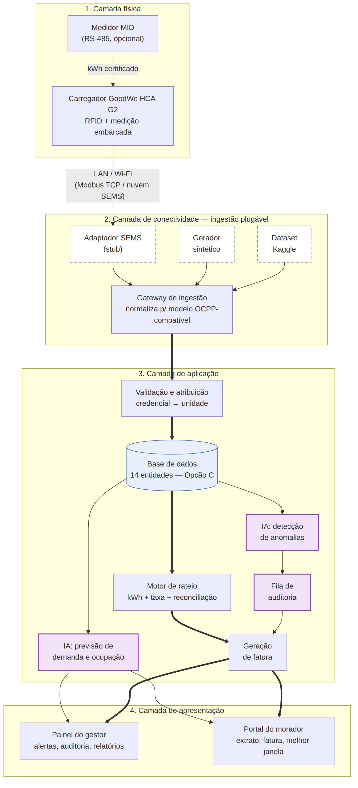
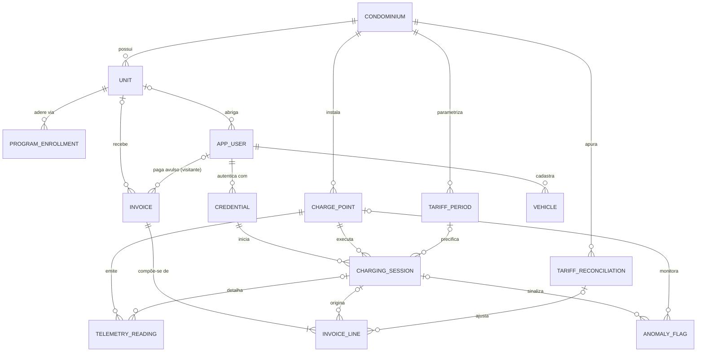

# Frente 3 — Arquitetura e IA

## Camadas da plataforma

> **Método.** Esta seção e a seguinte são o corpo obrigatório da Frente 3: organizam, nas quatro camadas pedidas pelo enunciado (física, conectividade, aplicação e apresentação), o que as demais seções deste dossiê e as Frentes 1 e 2 já estabeleceram. Nenhum componente é novo — cada caixa remete a uma decisão já documentada, com a remissão indicada. O diagrama de arquitetura está em [`../assets/arquitetura.png`](../assets/arquitetura.png) (fonte editável: [`../assets/arquitetura.mmd`](../assets/arquitetura.mmd)).



### Camada física — o carregador e a instalação

O ponto de recarga é o **GoodWe HCA G2** (7/11/22 kW, conector IEC Tipo 2, enquadrado como modo 3 da IEC 61851-1 — Frente 2, seção do carregador): wallbox CA com **leitor RFID** na partida (a chave da atribuição de sessão a usuário), **medição embarcada** de energia e potência e, opcionalmente, **medidor MID no RS-485** — a fonte de kWh com lastro metrológico que a Frente 2 recomendou rastrear pelo campo `measurement_source` desde o primeiro dia. A instalação obedece ao quadro mapeado na Frente 2, Opção A: IT-41 do CBPMESP (circuito exclusivo com DR individual, desligamento de emergência interligado ao alarme de incêndio, homologação ANATEL da comunicação sem fio) e as NBR 5410, NBR 17019 e NBR IEC 61851-1 que ela referencia, sob responsabilidade técnica registrada. A plataforma **cadastra** o responsável técnico e o documento de responsabilidade por SAVE — ela não substitui o projeto elétrico nem o estudo de demanda do profissional habilitado (IT-41, item 5.9.4); fornece a curva de carga real que o complementa.

### Camada de conectividade — rede, protocolos e a ingestão plugável

O HCA G2 conversa com o mundo por **LAN (RJ45) ou Wi-Fi** até o roteador da garagem (LAN preferível em subsolo — Frente 2) e declara um único protocolo: **Modbus TCP**. Não há OCPP nativo documentado, e a GoodWe não disponibilizará acesso à API SEMS para o desafio. A resposta arquitetural, fundamentada na Frente 2, é uma **camada de ingestão plugável**: três fontes intercambiáveis alimentam um **gateway de ingestão** que normaliza tudo para o modelo interno **OCPP-compatível** (sessão = StartTransaction → MeterValues → StopTransaction, o vocabulário da Frente 1):

1. **Adaptador SEMS (*stub*)** — implementa o contrato espelhado da documentação pública e comunitária (Frente 2, seção da API SEMS); especificado e adiável: vira integração real se e quando houver acesso, sem mexer no resto.
2. **Gerador sintético** — produz sessões e telemetria diretamente no esquema da Opção C, calibrado no dataset público (Opção B, seção de cold start).
3. **Dataset Kaggle** — as 3.395 sessões reais de Asensio et al., mapeadas campo a campo no contrato (Opção B).

Trocar de fonte é trocar de adaptador, não refatorar — a aposta verificável já declarada na Opção B. O **adaptador Modbus TCP local** fica registrado como candidato a caminho real de telemetria numa instalação própria (Frente 2, Análise da equipe). O desenho responde ao art. 552 da REN 1.000 (protocolos abertos para comunicação e supervisão) por espírito, não só por letra: o modelo interno nasce aberto e portável para qualquer carregador OCPP futuro.

### Camada de aplicação — back-end, regras de negócio e IA

O back-end é um pipeline de seis estágios, cada um já especificado em sua seção:

1. **Ingestão** — o gateway grava os eventos normalizados.
2. **Validação e atribuição** — resolve o `auth_id` bruto → `credential` → `app_user` → `unit` (decisão 2 da Opção C); visitante segue trilho próprio, fora do rateio.
3. **Persistência** — o esquema de 14 entidades da Opção C: `charging_session` como entidade central, `telemetry_reading` como série temporal, tarifas versionadas por vigência, faturas e linhas.
4. **Motor de rateio** — a fórmula da Opção A (kWh medido × tarifa snapshot + `C_disp / N_aderentes`), com a reconciliação em dois tempos da decisão 5 da Opção C (tarifa provisória na sessão, linha de ajuste no fechamento seguinte).
5. **Módulos de IA** — as abordagens 1 (previsão de demanda e ocupação) e 3 (detecção de anomalias) da Opção B, lendo **das mesmas tabelas que o motor de faturamento escreve** — sem pipeline paralelo de coleta.
6. **Geração de fatura** — `invoice` + `invoice_line`, com a fila de auditoria (linhas flagradas) resolvida antes do fechamento.

### Camada de apresentação — as interfaces do gestor e do morador

Duas interfaces, uma por persona, ambas consumindo apenas saídas das camadas anteriores:

- **Painel do gestor (síndico/administradora):** ocupação e saúde dos pontos (o caso Copel da Frente 1 fez disso funcionalidade de primeira classe), curva prevista de 7 dias com alertas de saturação e de limite de potência (Opção B, abordagem 1), **fila de auditoria** de anomalias com aceitar/contestar antes do fechamento da fatura (abordagem 3) e relatórios exportáveis para assembleia — exigência derivada da responsabilidade legal do síndico (Frente 1), incluindo a curva de carga real que alimenta a renovação do AVCB (IT-41, item 5.9.4).
- **Portal do morador:** extrato sessão a sessão (credencial, kWh, motivo de encerramento), fatura mensal com linhas explicadas (inclusive o ajuste de reconciliação), melhor janela de recarga prevista para o perfil dele e contestação informada das sessões sinalizadas.

## Fluxo de dados: da sessão à fatura

O caminho ponta a ponta, numerado. Os passos 1–4 acontecem no equipamento — na Sprint 2 são produzidos pelo gerador sintético e pelo dataset Kaggle, que entregam os mesmos eventos ao passo 5; do passo 5 em diante é a plataforma:

1. **Conexão.** Cabo plugado, o carregador detecta o veículo (estados do Control Pilot — Frente 1, anatomia da sessão); a telemetria muda para `connected`.
2. **Autenticação.** Cartão RFID (ou app) na partida; o carregador valida a credencial e libera a energia. O identificador bruto (`auth_id`) acompanha a sessão dali em diante.
3. **Sessão e telemetria.** A abertura registra leitura inicial do medidor e timestamp; durante a carga, amostras periódicas de potência e energia acumulada (os MeterValues da Frente 1) e heartbeats de saúde do ponto — inclusive fora de sessão.
4. **Encerramento.** Por bateria cheia, desconexão, queda de energia ou comando: leitura final, timestamp e **motivo do encerramento** (`stop_reason`).
5. **Ingestão e normalização.** O gateway traduz a fonte ativa (*stub* SEMS / gerador sintético / dataset Kaggle; futuramente, Modbus TCP local) para o modelo OCPP-compatível e grava `charging_session` e `telemetry_reading`.
6. **Validação e atribuição.** `auth_id` → credencial → unidade (a sessão guarda o bruto e a FK resolvida — decisão 2 da Opção C); no encerramento, grava-se o snapshot da tarifa provisória vigente (`applied_tariff_kwh`). Caso degenerado: leitura final perdida → energia pela última telemetria + flag de auditoria (caso 1 da Opção A).
7. **A IA intercepta — antes do fechamento.** A detecção de anomalias (Opção B, abordagem 3) avalia cada sessão encerrada e a saúde dos pontos; as flags, com explicação legível, entram na **fila de auditoria** e a linha de fatura correspondente nasce marcada (`flagged_for_audit`) — o gestor aceita ou contesta **antes** de a fatura fechar, nunca depois. Em paralelo, a previsão de demanda (abordagem 1) consome os agregados das mesmas tabelas e publica curva e alertas no painel — decisão operacional, sem efeito na fatura.
8. **Agregação mensal.** No fechamento da competência: `S_u` por unidade (sessão pertence ao mês civil do início), `N_aderentes` reconstruído de `program_enrollment`.
9. **Rateio e fatura.** A fórmula da Opção A, linha a linha com `round2` half-up: uma linha por sessão, uma da taxa de disponibilidade e, quando houver, a linha de ajuste da reconciliação da competência anterior (decisão 5 da Opção C). A `invoice` percorre `draft` → `under_review` (se há linhas em auditoria) → `closed`.
10. **Notificação e prestação de contas.** O morador recebe fatura e extrato no portal; o valor segue o trilho do boleto condominial existente (benchmark da Opção A — a integração financeira é da administradora, não nossa). O gestor exporta o relatório mensal — receita, kWh, resíduos de arredondamento declarados, flags e suas resoluções — para a assembleia.

O ciclo tem ainda um laço de retorno: quando a fatura da distribuidora da competência `M` chega, o sistema apura o R$/kWh efetivo, registra em `tariff_reconciliation` e a fatura de `M+1` carrega o ajuste por unidade — o mecanismo completo está na decisão 5 da Opção C, demonstrado com números no mês fictício.

### Análise da equipe

A leitura em quatro camadas não foi o ponto de partida do projeto — foi o teste final: as decisões nasceram de baixo para cima, das restrições documentadas nas Frentes 1 e 2, e o fato de se organizarem nas camadas do enunciado sem sobrar caixa órfã é o que dá confiança na costura. A assimetria deliberada do diagrama merece ser explicitada: a camada de conectividade, que numa arquitetura típica seria a mais fina (um broker OCPP e pronto), é aqui a mais carregada de decisão — porque é onde mora a dupla restrição real do projeto (carregador sem OCPP nativo documentado + API do fabricante inacessível), e a ingestão plugável com três fontes intercambiáveis é a restrição transformada em arquitetura, não contornada. O segundo traço distintivo é a posição da IA no fluxo: ela não é um estágio depois da fatura (dashboard que comenta o passado), é uma **interceptação entre a sessão e o fechamento** — a fila de auditoria do passo 7 é a materialização do critério "estrutural, não decorativo" da Opção B, e removê-la quebraria o próprio estado `under_review` da fatura. A fragilidade que registramos com a mesma franqueza: os passos 1–4 do fluxo são, hoje, especificação sem verificação — nenhum evento real de um HCA G2 atravessou este pipeline, e o contrato da camada de conectividade é hipótese documentada (Frente 2, com níveis de confiabilidade declarados). O desenho inteiro aposta que, quando o evento real chegar, ele entra pelo mesmo gateway sem mover nenhuma caixa das outras três camadas; é uma aposta com fundamento — o modelo interno espelha o OCPP, padrão verificado na Frente 1 — mas só a Sprint 2 a testa de ponta a ponta sobre dados sintéticos, e só uma instalação real a cobra de verdade.

## Opção A — Benchmark e modelo de rateio

> **Método.** Esta seção responde à exigência central do enunciado: o modelo de rateio da equipe, com as variáveis usadas, o cálculo da fatura individual e o tratamento dos casos excepcionais. Antes de definir, benchmarkamos como condomínios reais estruturam a cobrança hoje — fontes acessadas em 2026-06-09, com remissão às Frentes 1 e 2 para o que já está documentado lá (modelos de negócio, REN 1.000, Lei 17.336, tarifa Enel SP).

### Benchmark — como o mercado rateia hoje

A taxonomia de cinco modelos de monetização já está na Frente 1 (Modelos de negócio); aqui o recorte é outro: **como soluções reais operam o rateio dentro de condomínios**. Quatro arranjos distintos, cada um com pelo menos um praticante identificado:

**1. kWh medido por usuário, repassado no boleto condominial (WEG WEMOB e NeoCharge, Brasil).** O morador se identifica no carregador (cartão RFID ou app), a estação mede a energia de cada recarga e a plataforma consolida o consumo do mês. Na WEMOB, *"pode ser realizado o rateio de consumo, adicionados os custos no boleto do condomínio e enviada a cobrança via cartão de crédito ou cartão RFID"* [WEG WEMOB, 2026] — ou seja, o repasse usa o trilho de cobrança que o condomínio já tem. A NeoCharge descreve o mesmo desenho: medir *"quanto cada morador utilizou de energia"* e dividir ao final do mês (detalhada na Frente 1, Opção A). É o modelo dominante entre os players brasileiros de condomínio.

**2. Cobrança direta pelo operador, com reembolso ao condomínio (ChargePoint, EUA).** O operador fatura o morador diretamente (*"bill residents directly for their energy usage"*) e devolve ao condomínio o custo da energia (*"reimburse you for your out-of-pocket electricity costs"*), com preço definido pelo gestor por grupo de usuário (morador, visitante) [ChargePoint, 2026]. O condomínio sai do fluxo financeiro — atraente para o síndico, mas a engenharia de reembolso pressupõe o sistema de pagamentos norte-americano (limitação já registrada na Frente 1, Opção A).

**3. Concessão interna: a empresa investe e cobra tarifa própria por kWh (EZVolt, Brasil).** No modelo *turn-key* da EZVolt para condomínios residenciais, *"todo o investimento é feito pela Easy Volt"*; o morador paga a recarga pelo app, com *"tarifas de carregamento personalizadas"*, e o condomínio pode até receber participação na receita [EZVolt, 2026]. O CAPEX zero tem preço: a tarifa por kWh embute o retorno do investimento da empresa e fica tipicamente bem acima do custo da energia da distribuidora — o condômino paga preço de eletroposto na própria garagem.

**4. Taxa fixa mensal por unidade aderente.** Documentado como prática corrente em material de mercado: *"todos os usuários pagam uma taxa, independentemente do uso"* [Ambare, 2026]. Aparece também na variante contratual de mensalidade fixa de manutenção do equipamento (*"é acordado um valor mensal para manutenção"*) [CondoCash, 2026]. Simples de administrar (não exige medição por usuário), mas dissociado do consumo. A primeira fonte registra a degeneração desse caminho — diluir tudo na cota condominial — como *"pouco recomendado, pois moradores que não usam o serviço acabam pagando por ele"* [Ambare, 2026]. Há ainda a cobrança **por tempo de ocupação** (totem que mede tempo conectado), registrada como alternativa para prédios sem medição individual, mas *"um método um pouco mais impreciso"* [CondoCash, 2026] — e a Frente 1 já mostrou, no caso Copel, que cobrar minuto penaliza quem carrega mais devagar.

| Modelo | Praticante real | Vantagens | Limitações |
|---|---|---|---|
| kWh medido + boleto condominial | WEG WEMOB, NeoCharge (BR) | Justiça por consumo; atende a medição individualizada da Lei 17.336; usa o trilho de cobrança existente | Exige identificação por sessão e plataforma de gestão; custos fixos ficam sem dono se não houver taxa complementar |
| Cobrança direta + reembolso | ChargePoint (EUA) | Síndico fora do fluxo financeiro; inadimplência é problema do operador | Não opera no BR; reembolso pressupõe outro sistema financeiro; taxa de serviço por sessão repassada ao morador |
| Concessão interna (kWh com margem) | EZVolt (BR) | CAPEX zero para o condomínio; operação e manutenção terceirizadas | Tarifa final muito acima do custo da energia; lock-in contratual com o operador; menos transparência de formação de preço |
| Taxa fixa por unidade | prática de mercado [Ambare, 2026; CondoCash, 2026] | Simplicidade administrativa; receita previsível | Injusta com quem usa pouco; subsidia quem usa muito; não atende ao espírito de medição individualizada da Lei 17.336 |

Duas convergências do benchmark orientam a decisão:

- (i) todos os modelos com medição tratam o **kWh como base da cobrança variável** — ninguém rateia energia por fração ideal ou por tempo quando há medição disponível;
- (ii) os custos **fixos** (manutenção, plataforma, depreciação) são o ponto cego do modelo kWh puro — ou são empurrados para a margem de um operador (modelos 2 e 3), ou ficam órfãos e acabam diluídos na cota condominial, recriando o subsídio cruzado que o rateio veio eliminar.

### O modelo do EV ChargeOps: kWh medido por sessão + taxa de disponibilidade

**Decisão da equipe**, validada pelo benchmark: modelo **híbrido em duas parcelas**, faturado mensalmente por unidade condominial.

- **Parcela variável** — a energia de cada sessão atribuída à unidade, ao preço de repasse da distribuidora. Quem carrega paga o que consumiu, ao custo, sem margem.
- **Parcela fixa** — uma taxa de disponibilidade rateada igualmente entre as unidades **aderentes** ao programa de recarga (não entre todas as unidades do condomínio), cobrindo os custos fixos de manter o serviço disponível.

A fatura mensal da unidade `u` no mês `M`:

```
fatura_u = sum(round2(kwh_s × tarifa_s) for s in S_u) + round2(C_disp / N_aderentes)
```

| Variável | Unidade | Definição | Origem do dado |
|---|---|---|---|
| `S_u` | conjunto | Sessões encerradas no mês `M` atribuídas a credenciais da unidade `u` (sessão pertence ao mês do seu **início**) | Eventos de sessão (modelo OCPP da Frente 1: StartTransaction → StopTransaction) + vínculo credencial → unidade no cadastro |
| `kwh_s` | kWh (3 casas) | Energia entregue na sessão `s` | `meterStop − meterStart` do carregador; preferência por medidor certificado quando presente (campo `measurement_source` da Frente 2) |
| `tarifa_s` | R$/kWh (4 casas) | Tarifa de repasse **vigente na data de início** de `s`, gravada na sessão no momento do encerramento (snapshot, imune a reajuste retroativo) | Tarifa homologada ANEEL da distribuidora do condomínio (dossiê da Frente 2, seção "Opção C — APIs complementares") + tratamento de tributos (decisão pendente abaixo) |
| `C_disp` | R$/mês | Taxa de disponibilidade total do mês — o orçamento fixo do serviço | Valor aprovado em assembleia, cadastrado por condomínio |
| `N_aderentes` | inteiro ≥ 1 | Unidades aderentes ao programa no mês `M` | Cadastro de adesão por unidade |
| `round2` | — | Arredondamento a centavos, meio-para-cima (half-up), aplicado **por linha da fatura** | Regra do motor de faturamento |

Três decisões da equipe embutidas na fórmula, com justificativa:

1. **O que a taxa de disponibilidade cobre.** *Decisão da equipe:* o OPEX recorrente do serviço — manutenção preventiva/corretiva, assinatura da plataforma e um fundo de reposição do equipamento (depreciação) — e **não** o CAPEX da instalação inicial, que é decisão de obra da assembleia e segue as regras condominiais gerais (a Lei 18.403/2026 silencia sobre rateio de obras coletivas, lacuna registrada na Frente 1). Racional: sem a taxa, o custo fixo migra para a parcela variável (penalizando o uso) ou para a cota de todos (recriando o subsídio cruzado); com ela, quem reserva o direito de usar a infraestrutura paga por mantê-la disponível.
2. **Tributos (decisão pendente de validação externa).** A tarifa homologada da ANEEL vem **sem tributos** — para a Enel SP, grupo B3 convencional, TUSD + TE = R$ 725,18/MWh ≈ R$ 0,7252/kWh, vigente até 03/07/2026 (verificada por chamada real no dossiê da Frente 2, seção "Opção C — APIs complementares") — enquanto a fatura que o condomínio efetivamente paga embute ICMS e PIS/COFINS. *Posição preliminar da equipe:* usar como `tarifa_s` o **R$/kWh efetivo da fatura do condomínio** (total da fatura ÷ kWh faturados), porque garante repasse exato do custo, sem lucro nem prejuízo para o condomínio — o desenho de reembolso de custo é também o que mantém o rateio fora da zona cinzenta tributária ISS×ICMS deixada em aberto na Frente 2 (Análise da equipe da Opção A): repasse sem margem não é venda de energia nem prestação onerosa de serviço de recarga. A alternativa (tarifa homologada + tributos parametrizados) é mais auditável linha a linha, mas pode divergir da fatura real (bandeiras tarifárias, por exemplo).

   > **Pendência para a Sprint 2:** validar com administradora e contador antes da Sprint 2.
3. **Arredondamento.** Half-up a centavos por linha (cada sessão e a taxa viram linhas independentes da fatura). O resíduo do rateio da taxa (`C_disp` pode não ser divisível por `N_aderentes` em centavos exatos) fica com o caixa do condomínio — diferença máxima de centavos, declarada no relatório mensal. Justiça auditável vale mais que precisão de frações de centavo.

**Demonstração curta** (o mês fictício completo, com várias unidades, é objeto da Opção C): unidade 72, mês com 3 sessões, tarifa de referência R$ 0,7252/kWh (Enel SP B3, sem tributos), `C_disp` = R$ 180,00, 12 unidades aderentes:

| Linha | Cálculo | Valor |
|---|---|---|
| Sessão 1 — 18,4 kWh | 18,4 × 0,7252 = 13,34368 | R$ 13,34 |
| Sessão 2 — 25,0 kWh | 25,0 × 0,7252 = 18,13000 | R$ 18,13 |
| Sessão 3 — 9,3 kWh | 9,3 × 0,7252 = 6,74436 | R$ 6,74 |
| Taxa de disponibilidade | 180,00 / 12 = 15,00 | R$ 15,00 |
| **Fatura da unidade 72** | | **R$ 53,21** |

### Casos excepcionais

Os três casos exigidos pelo enunciado, e como o modelo os resolve **por construção** (nenhum exige regra ad hoc):

1. **Sessão interrompida** (queda de energia, cabo desconectado, desligamento de emergência da IT-41). Cobra-se exatamente o `kwh_s` entregue até a interrupção — a fórmula opera sobre leituras de medidor, não sobre intenção de recarga. O motivo do encerramento (campo do StopTransaction, Frente 1) fica registrado na linha da fatura. Caso degenerado: se a telemetria perder a leitura final, usa-se a última leitura periódica conhecida (MeterValues) — sempre o valor medido mais conservador, nunca estimativa para cima — e a sessão é sinalizada para auditoria no relatório do síndico.
2. **Usuário que não carregou no mês.** `S_u` vazio → parcela variável zero; a unidade aderente paga apenas `C_disp / N_aderentes`. É o comportamento desejado, não um caso de borda: a taxa remunera a disponibilidade da infraestrutura (a vaga de recarga existe, mantida e à disposição), não o uso. Unidade que nunca aderiu não paga nada — o rateio alcança só quem optou pelo serviço.
3. **Dois veículos da mesma unidade.** A fatura é **por unidade, não por veículo**: cada credencial (cartão RFID ou conta no app) é vinculada a uma unidade no cadastro, e `S_u` agrega as sessões de todas as credenciais da unidade. O extrato discrimina sessão a sessão, com a credencial que a iniciou — o casal vê qual carro consumiu o quê, mas recebe uma fatura só. *Decisão da equipe:* a taxa de disponibilidade é única por unidade, independentemente do número de veículos — o rateio é da infraestrutura comum, e cobrá-la por veículo puniria a composição familiar sem lastro em custo adicional real.

Outros casos que o esquema de dados (Opção C) e o motor de faturamento precisam suportar, registrados como insumo: **visitante** (credencial avulsa fora do rateio, com tarifa própria definida pelo condomínio — o art. 554 da REN 1.000 permite); **mudança de tarifa no meio do mês** (resolvida pelo snapshot `tarifa_s` por sessão); **adesão ou saída de unidade no meio do mês** (pro rata por dias de adesão sobre a parcela fixa — parâmetro do condomínio); **inadimplência** (a suspensão de credencial é decisão de assembleia, não automatismo da plataforma — risco jurídico condominial); e **sessão atravessando a virada do mês** (pertence ao mês do início, já definido em `S_u`).

### Análise da equipe

O híbrido kWh + taxa de disponibilidade vence porque é o único desenho que responde simultaneamente às três forças mapeadas no dossiê. Primeira, a **regulatória**: a Lei municipal 17.336/2020 exige *"medição individualizada e cobrança"* (Frente 2, Opção A) — a parcela variável por kWh medido é a implementação literal disso, e a taxa fixa pura (modelo 4 do benchmark) não a atende. Segunda, a **convergência do mercado**: os praticantes brasileiros do rateio condominial (WEMOB, NeoCharge) já operam kWh medido com identificação por RFID/app — nosso modelo não inventa um arranjo exótico, refina o dominante com a peça que falta (o destino explícito dos custos fixos, que o benchmark mostrou ser o ponto cego). Terceira, a **percepção de justiça**: a dor número 2 da Frente 1 é o subsídio cruzado entre usuários e não usuários; o híbrido o elimina nas duas direções — quem não aderiu não paga nada, quem aderiu e não usou paga só a disponibilidade que de fato consome (a infraestrutura pronta), quem carregou paga o seu kWh ao custo. Essa hipótese de justiça percebida é exatamente o que o roteiro de entrevistas da Frente 1 vai testar com moradores e síndicos — se as entrevistas indicarem resistência à taxa fixa, o parâmetro `C_disp` admite zero sem quebrar o motor (degrada para kWh puro, com o custo fixo de volta à cota condominial, decisão da assembleia). Rejeitamos explicitamente: a concessão (modelo 3), porque resolve o problema do síndico criando um problema para o morador (tarifa com margem de operador) e contraria a vocação da plataforma de dar transparência de custo, não de intermediar venda; e a cobrança por tempo, pela distorção já documentada no caso Copel (Frente 1) — tempo entra no modelo apenas como candidata futura a multa de ociosidade (carro-tampão), parametrizável, fora do cálculo de energia. Por fim, o modelo é deliberadamente **simples de auditar em assembleia**: duas parcelas, uma fórmula de uma linha, tarifa ancorada em fonte pública citável (dossiê da Frente 2, seção "Opção C — APIs complementares") — porque o benchmark e a Frente 1 convergem em que o rateio fracassa menos por matemática errada e mais por desconfiança de quem paga.

## Opção B — Papel da IA

> **Método.** A rubrica do desafio dedica um critério próprio a esta seção: o papel da IA deve ser *"estrutural, não decorativo"*. Tratamos isso como exigência de engenharia, não de retórica, com um teste objetivo que cada abordagem precisa passar: declarar (i) **quais campos do esquema de dados consome**, (ii) **que saída produz** e (iii) **qual decisão concreta — do gestor ou do morador — essa saída habilita**. Abordagem que não passa no teste fica fora do núcleo. Fontes acessadas em 2026-06-09; o dataset público sugerido pelo enunciado foi identificado no Kaggle e verificado na sua fonte acadêmica de origem.

### O que as três abordagens têm em comum: o mesmo dado, nenhuma instrumentação extra

A matéria-prima é o contrato de sessão já especificado na Frente 2 (corpo obrigatório) e que a Opção C detalha como esquema: `charge_point_id`, `session_start`/`session_end`, `energy_kwh`, `power_kw` (série temporal), `state`, `auth_id`, `measurement_source` — mais o cadastro (credencial → unidade, adesão) e a tarifa vigente que o motor de rateio (Opção A) já usa. A Frente 1 já havia registrado que os `MeterValues` periódicos do OCPP são o insumo natural dessa camada, *"sem custo adicional de instrumentação, pois o protocolo já entrega a telemetria"*. A consequência arquitetural: **a IA não tem pipeline paralelo de coleta** — lê das mesmas tabelas que o motor de faturamento escreve, devolve saídas para o painel do gestor e, no caso das anomalias, devolve flags para a própria fatura.

**Decisão da equipe — a restrição de infraestrutura como critério técnico, não desculpa:** a Sprint 2 roda em máquina modesta, sem GPU. Para dados tabulares de sessões — milhares de linhas, dezenas de features — esse é exatamente o território onde métodos clássicos e interpretáveis (scikit-learn, statsmodels) vencem deep learning em custo, robustez com pouco dado e, decisivo no nosso contexto, **explicabilidade**. A Opção A concluiu que o rateio fracassa menos por matemática errada e mais por desconfiança de quem paga; a mesma régua vale aqui: previsão que o síndico não consegue explicar em assembleia não embasa decisão nenhuma.

### Abordagem 1 — Previsão de demanda e ocupação

| | |
|---|---|
| **Problema que resolve** | As dores 1 e 3 da Frente 1: a aproximação do limite de potência da instalação, e a fila e disputa pelo carregador compartilhado. Também alimenta uma obrigação regulatória: a IT-41 (item 5.9.4) exige estudo de demanda e curva de carga ratificando a viabilidade da infraestrutura — e a Frente 2 já apontou que a curva real medida é o complemento operacional desse estudo. |
| **Técnica** | Baseline: regressão com features de calendário (hora do dia em codificação cíclica, dia da semana, feriado), na linha do exemplo oficial do scikit-learn de previsão de demanda horária com features temporais [scikit-learn, 2026a]. Evolução: gradient boosting (`HistGradientBoostingRegressor`) com lags de 24 h e 168 h; alternativa estatística com sazonalidade semanal explícita via statsmodels (SARIMAX) [statsmodels, 2026]. |
| **Dados necessários** | Sessões agregadas em grade dia × hora por ponto: contagem de sessões ativas e kWh entregues, derivados de `session_start`/`session_end`/`energy_kwh`; potência horária de `power_kw`. Mínimo prático: 8–12 semanas de histórico para capturar o ciclo semanal. |
| **Impacto esperado** | Gestor deixa de descobrir a saturação na reclamação do morador e passa a vê-la com 7 dias de antecedência; a decisão de ampliar a infraestrutura sai do achismo para uma estimativa de demanda reprimida calculada da própria curva. |

**No fluxo sessão → fatura → decisão:** entrada = agregados dia × hora das sessões encerradas; saída = curva prevista de ocupação e de potência para os próximos 7 dias, por ponto e agregada, mais dois alertas no painel — saturação (ocupação prevista no pico acima de limiar configurado, ex.: > 90% em 3 ou mais dias da semana) e potência (pico previsto se aproximando da capacidade declarada da instalação, o dado que a Lei 18.403 faz o condomínio declarar). Decisões habilitadas: **do gestor** — abrir janela de reserva ou ajustar a política de tempo máximo antes do conflito; levar à assembleia a proposta de segundo carregador com estimativa de payback derivada da própria curva (sessões não atendidas previstas × kWh médio × tarifa, contra o acréscimo de `C_disp`); anexar a curva real + prevista ao documento de responsabilidade técnica na renovação do AVCB (IT-41, item 5.9.4). **Do morador** — ver no app os horários previstos de menor disputa antes de descer com o carro.

### Abordagem 2 — Clustering de perfis de uso

| | |
|---|---|
| **Problema que resolve** | Política de janelas, incentivos e tarifas diferenciadas hoje se decide no palpite. A Frente 1 identificou como lacuna de mercado a simulação de quanto cada modelo tarifário arrecadaria antes de adotá-lo — simulação que só é honesta se respeitar os perfis reais de uso, não um usuário médio fictício. |
| **Técnica** | k-means sobre features padronizadas por usuário, com escolha de k por coeficiente de silhueta; DBSCAN como alternativa que isola perfis raros como ruído em vez de forçá-los num cluster [scikit-learn, 2026b]. O precedente de domínio é forte: Helmus et al. (2020) derivaram 13 tipos estáveis de sessão e uma tipologia de usuários clusterizando 4,9 milhões de transações de recarga públicas holandesas a partir de exatamente as variáveis que temos (hora de início da conexão, duração, intervalo entre sessões) [Helmus et al., 2020]. |
| **Dados necessários** | Features por credencial/unidade derivadas do histórico: kWh médio por sessão, hora típica de início (codificação cíclica), frequência semanal, duração média conectada, razão tempo carregando / tempo conectado. Exige base com 20–30 usuários ativos no mínimo — justificativa na decisão de escopo da seção de cold start, abaixo. |
| **Impacto esperado** | O simulador tarifário passa a responder por segmento ("a tarifa noturna reduzida desloca os perfis de rotina sem mexer na receita dos esporádicos"); o morador recebe recomendação de janela compatível com o perfil dele, não um aviso genérico. |

**No fluxo sessão → fatura → decisão:** entrada = features agregadas por credencial sobre as mesmas sessões que geram a fatura; saída = rótulo de perfil por unidade (ex.: rotina noturna, esporádico de fim de semana, alto consumo concentrado) gravado no cadastro e re-estimado mensalmente. Decisões habilitadas: **do gestor** — desenhar janelas de reserva que separem perfis concorrentes e simular, antes da assembleia, o efeito de uma tarifa diferenciada sobre cada segmento (a funcionalidade de decisão que a análise de mercado da Frente 1 mostrou que nenhum player oferece); **do morador** — recomendação de janela de recarga com menor disputa para o perfil dele.

### Abordagem 3 — Detecção de anomalias

| | |
|---|---|
| **Problema que resolve** | Três riscos distintos com a mesma assinatura nos dados: saúde do equipamento (o caso Copel da Frente 1 — eletropostos fora de operação sem sinalização — fez a equipe promover monitoramento de saúde a funcionalidade de primeira classe), integridade da fatura (sessão com medição inconsistente contamina o rateio) e uso fora de política (ociosidade do carro-tampão, credencial usada em padrão atípico). |
| **Técnica** | Fase 1, desde o primeiro dia: regras estatísticas interpretáveis por usuário e por ponto (z-score/IQR sobre o histórico próprio). Fase 2, quando houver volume: Isolation Forest sobre o vetor de features da sessão — método de conjunto que isola observações raras sem precisar de exemplos rotulados de fraude/falha, adequado a base pequena e CPU [scikit-learn, 2026c; scikit-learn, 2026d]. |
| **Dados necessários** | A sessão individual e seu contexto: `energy_kwh` contra o histórico da credencial, duração, razão kWh/hora contra a potência nominal do ponto (7–22 kW no HCA G2), tempo em `state` conectado sem corrente, horário contra o padrão da credencial; na camada de saúde, heartbeats perdidos e taxa de sessões falhas por ponto. |
| **Impacto esperado** | Manutenção sai do modo reativo (morador reclama que não carrega) para o preditivo (razão kWh/hora caindo semana a semana = degradação antes da falha); a fatura ganha uma fila de auditoria que protege a confiança no rateio; a política de ociosidade ganha base de evidência em vez de denúncia de vizinho. |

**No fluxo sessão → fatura → decisão:** entrada = cada sessão encerrada + telemetria de status do ponto; saída = flag por sessão com categoria e explicação legível (consumo 4× o padrão da credencial; 6 h conectado com 0 kWh; potência média 30% abaixo da nominal) numa fila de revisão do painel, e a sessão flagrada **entra na fatura marcada para auditoria** — o mesmo mecanismo que a Opção A já definiu para sessão interrompida com telemetria perdida. Decisões habilitadas: **do gestor** — abrir chamado de manutenção antes da falha total; aceitar ou contestar a linha flagrada antes de fechar a fatura do mês; aplicar (ou propor em assembleia) a política de ociosidade com histórico objetivo. **Do morador** — extrato com as próprias sessões sinalizadas, contestação informada em vez de surpresa no boleto. **Decisão da equipe:** nenhuma saída de anomalia dispara punição automática — suspensão de credencial é decisão de assembleia (coerente com o tratamento de inadimplência da Opção A); a IA produz evidência, o humano decide.

### Síntese: onde cada abordagem entra no fluxo

| Abordagem | Entrada (campos do esquema) | Saída | Decisão habilitada (de quem) | Sprint 2 |
|---|---|---|---|---|
| 1. Previsão de demanda | `session_start/end`, `energy_kwh`, `power_kw` agregados dia × hora | Curva de ocupação/potência 7 dias + alertas de saturação e de limite | Janela de reserva; proposta de 2º carregador com payback; anexo IT-41 (gestor) · melhor horário (morador) | **Sim** |
| 2. Clustering de perfis | Features por credencial (kWh médio, hora típica, frequência, duração) | Rótulo de perfil por unidade, mensal | Janelas por perfil; simulação tarifária por segmento (gestor) · recomendação de janela (morador) | Especificada; implementação adiada |
| 3. Detecção de anomalias | Sessão individual + histórico da credencial + telemetria de status | Flag com categoria e explicação; linha de fatura marcada para auditoria | Manutenção preditiva; auditoria pré-fechamento da fatura; política de ociosidade (gestor) · contestação informada (morador) | **Sim** (fase 1 regras + fase 2 Isolation Forest) |

### Cold start e o dataset da Sprint 2

Honestidade primeiro: **nos primeiros meses não existe histórico do condomínio** — e a Frente 2 mostrou que nem o SEMS expõe sessões encerradas. Nenhum modelo treina no vazio, então a Sprint 2 trabalha em três degraus: (i) regras estatísticas simples já operam com semanas de dado (a fase 1 da abordagem 3 e limiares fixos de ocupação); (ii) um **gerador de dados sintéticos** produz sessões no esquema da Opção C; (iii) o gerador é **calibrado num dataset público real**, para que as distribuições (kWh por sessão, duração, frequência por usuário) não sejam invenção nossa.

O dataset escolhido é o sugerido pelo enunciado (§ 7.4): *Electric Vehicle Charging Dataset* no Kaggle [Kaggle/Bryant, 2026] — o enunciado o chama de "Electric Vehicle Charging Sessions", título que não existe literalmente no Kaggle; o match foi feito pela descrição (sessões reais de frota corporativa nos EUA). Ele reempacota o dado publicado por Asensio, Lawson e Apablaza na revista Scientific Data — **3.395 sessões reais de recarga, 85 motoristas identificados e recorrentes, 105 estações AC nível 2 em 25 instalações de um campus corporativo nos EUA, 46 semanas (nov/2014–out/2015)**, dado primário depositado no Harvard Dataverse [Asensio et al., 2021; Harvard Dataverse, 2021]. As variáveis centrais do artigo mapeiam direto no esquema da Opção C: identificadores de sessão, usuário (→ `auth_id`), estação (→ `charge_point_id`) e local; timestamps de início e fim ao segundo (→ `session_start`/`session_end`); energia total em kWh (→ `energy_kwh`); duração em horas; custo da sessão; dia da semana; tipo de instalação; indicador de usuário habitual vs. casual. Ficam de fora apenas a série temporal de potência (`power_kw`) e os campos de estado e de origem da medição (`state`, `measurement_source`), que o gerador sintético produz por conta própria. Entre os candidatos no Kaggle, este é o escolhido por três razões: é o que a descrição do enunciado designa (sessões reais de frota corporativa nos EUA); é o único com proveniência acadêmica revisada por pares e DOI público — os concorrentes ou são espelhos deste mesmo dado ou não declaram origem (vários são sintéticos sem documentação); e o contexto é o análogo mais próximo do nosso: recarga AC com usuários recorrentes identificados, onde o carro passa horas estacionado no mesmo lugar.

**Limitação declarada e uso correto:** recarga de trabalho é o espelho diurno do condomínio — os carros chegam de manhã e saem à tarde; no condomínio, chegam à noite. O dataset serve para **calibrar as formas das distribuições e validar o pipeline ponta a ponta** (com o eixo horário espelhado para o padrão noturno e os testes de anomalia injetados com rótulo conhecido pelo gerador), **não** para aprender sazonalidade ou horários brasileiros. Todo modelo entregue na Sprint 2 carrega o aviso de calibração: as previsões viram recomendação operacional somente após N semanas de dado local — N definido pela própria validação (quando o erro sobre dado local cruza o erro sobre dado sintético).

**Decisão da equipe — o que a Sprint 2 implementa: abordagens 1 e 3.** Três razões. Primeira, são as que atacam as dores com evidência mais forte no dossiê: limite de potência e saturação/fila (dores 1 e 3 da Frente 1) e o alerta operacional do caso Copel (disponibilidade destrói confiança mais rápido do que funcionalidade a constrói). Segunda, são avaliáveis com métrica objetiva mesmo sem dado real: erro absoluto médio da previsão contra o gerador, precisão/recall da detecção sobre anomalias injetadas com gabarito. Terceira, sobrevivem ao cold start (regras antes de ML). O clustering (abordagem 2) fica integralmente especificado — features, técnica, decisões que habilita — mas a implementação é adiada por um motivo estatístico que preferimos declarar a maquiar: **k-means sobre as 10–20 unidades aderentes de um único condomínio no primeiro ano é numerologia, não aprendizado**; o precedente de Helmus et al. operou sobre 27 mil usuários (número declarado no abstract do artigo [Helmus et al., 2020]). Na Sprint 2, os perfis aparecem como segmentos definidos por regra (rotina noturna / diurno / esporádico) dentro do simulador tarifário, e o clustering entra quando houver base multi-condomínio.

**Anti-padrão que rejeitamos no núcleo: interface conversacional (NLP).** O enunciado a cita como exemplo de abordagem possível, e registramos por que a descartamos do núcleo: um chatbot não consome a telemetria (falha no teste de entrada), não habilita decisão que o painel bem desenhado não habilite (falha no teste de decisão) e seu custo de operação briga com a restrição de infraestrutura. É a definição prática de IA decorativa neste produto. Fica anotada como possibilidade futura — uma camada de consulta em linguagem natural **sobre** as saídas das três abordagens — explicitamente fora do escopo das Sprints 1 e 2.

### Análise da equipe

O critério da rubrica tem um teste prático que aplicamos a nós mesmos: **decorativo é o que se remove sem ninguém notar**. Removida a IA desta plataforma, quebram entregáveis nomeados — o alerta de saturação do painel, a estimativa de payback que embasa a assembleia do segundo carregador, o anexo de curva de carga da renovação do AVCB, a fila de auditoria que protege a fatura e a manutenção preditiva que responde ao caso Copel. Nenhum desses é um gráfico bonito ao lado do produto; são funções pelas quais gestor e morador tomam decisões com consequência financeira. A escolha por métodos clássicos e interpretáveis não é conformismo com a máquina modesta. É coerência com a tese da Opção A de que, em condomínio, auditabilidade vale mais que sofisticação. Um gradient boosting com features de calendário se explica em assembleia; uma rede neural, não. O risco que registramos com a mesma franqueza: modelos calibrados em dado sintético derivado de um campus americano de 2014–2015 nascem errados em algum grau, e o produto trata isso como propriedade declarada (aviso de calibração, métrica de quando confiar) em vez de esconder. A aposta verificável da Sprint 2 é, portanto, dupla: que o pipeline previsão + anomalia rode de ponta a ponta sobre o esquema da Opção C em infraestrutura mínima, e que a transição sintético → real exija troca de dados, não refatoração — exatamente o mesmo desenho de adaptador plugável que a Frente 2 adotou para a API do fabricante.

## Opção C — Esquema da base de dados

> **Método.** Esta seção é o contrato central da Sprint 2: o motor de rateio (Opção A), as abordagens de IA (Opção B), o gerador de dados sintéticos e a camada de ingestão plugável (Frente 2) leem e escrevem **estas tabelas**. O esquema foi derivado de trás para frente — primeiro listamos tudo o que a fórmula de rateio, os casos excepcionais e as três abordagens de IA exigem dos dados; depois desenhamos as entidades que satisfazem essas exigências; por fim verificamos campo a campo (tabela de rastreabilidade abaixo) e rodamos um mês fictício completo, com a aritmética conferida por script em aritmética decimal half-up. Nenhuma fonte externa nova: o material é todo derivação interna do dossiê.

### Decisões de modelagem

1. **Nomenclatura em inglês, glosa em português.** *Decisão da equipe:* entidades e colunas em inglês (`charging_session.energy_kwh`, não `sessao.kwh_entregue`). Três razões: o esquema vira código na Sprint 2 e identificadores com acento ou cedilha são fonte de bug; o contrato espelhado da Frente 2 já nasceu em inglês (`session_start`, `energy_kwh`, `auth_id`...) e mantê-lo evita uma camada de tradução; e o modelo interno é OCPP-compatível por decisão da Frente 2, e o vocabulário OCPP é inglês. O mapeamento para os nomes em português usados no restante do dossiê: `app_user` = usuário; `unit` = unidade; `vehicle` = veículo; `charging_session` = sessão; `charge_point` = carregador; `tariff_period` = vigência de tarifa; `invoice` = fatura; `invoice_line` = item de fatura.

2. **Credencial é entidade própria, separada do usuário.** A Opção A fatura por unidade agregando *credenciais* (cartão RFID ou conta de app), e a Frente 2 mostrou que a atribuição sessão → usuário é o coração do produto — o carregador autentica o cartão, a plataforma autentica a pessoa. Modelar a credencial como atributo do usuário (um `tag_rfid` em `app_user`) quebraria três casos reais: usuário com cartão **e** app, cartão perdido e substituído (a credencial antiga precisa continuar resolvendo as sessões históricas) e o visitante com credencial avulsa. A sessão grava o `auth_id` bruto recebido do carregador **e** a FK para a credencial resolvida — redundância deliberada: se o cadastro for corrigido depois, a trilha de auditoria preserva o que o equipamento de fato reportou.

3. **Fatura por unidade, não por usuário nem por veículo.** É a decisão da Opção A (caso 3) virando chave estrangeira: `invoice.unit_id`. O casal com dois carros gera sessões por duas credenciais distintas, mas `S_u` agrega tudo na mesma fatura — o extrato discrimina por linha qual credencial iniciou cada sessão. Veículo existe no esquema (`vehicle`) como cadastro para UX e features de IA (capacidade da bateria contextualiza anomalia de consumo), mas **nenhuma FK de faturamento passa por ele**. Exceção única: sessão de visitante gera fatura avulsa com `unit_id` nulo e `visitor_user_id` preenchido (restrição: exatamente um dos dois), fora do rateio — como o art. 554 da REN 1.000 permite e a Opção A registrou.

4. **Tarifa versionada por vigência + snapshot na sessão.** Tarifa muda (a homologada Enel SP vigora até 03/07/2026; `C_disp` é revisável em assembleia). Guardar um valor único "atual" faria um reajuste reescrever o passado. Por isso `tariff_period` tem `valid_from`/`valid_to` (vigências sem sobreposição por condomínio) e a sessão grava, no encerramento, **o valor aplicado** (`applied_tariff_kwh`) além da FK — o snapshot da Opção A, imune até a uma correção retroativa da própria vigência.

5. **Reconciliação de tarifa: provisória na sessão, ajuste no fechamento.** A tensão a resolver: a Opção A define `tarifa_s` como snapshot no encerramento da sessão, mas a posição preliminar de tributos manda usar o R$/kWh **efetivo da fatura do condomínio** — que só existe quando a fatura da distribuidora chega, semanas depois. *Decisão da equipe:* as duas coisas, em dois tempos. A sessão grava uma **tarifa provisória** (a melhor estimativa vigente: o efetivo apurado do último mês conhecido; no primeiro ciclo, sem histórico, a homologada ANEEL como bootstrap declarado). A fatura da competência `M` fecha no dia previsto com a provisória. Quando a fatura da distribuidora de `M` chega, o sistema apura o efetivo (`total ÷ kWh faturados`, 4 casas), registra em `tariff_reconciliation` e a fatura de `M+1` carrega **uma linha de ajuste por unidade**: `round2(kwh_total_u_em_M × (efetiva − provisória))` — positiva ou negativa. Uma linha por unidade (e não o recálculo sessão a sessão) mantém a fatura legível e limita o erro de arredondamento a 1 centavo por unidade. O desenho preserva a posição da Opção A (o condômino paga, no acumulado, exatamente o custo efetivo — repasse sem margem) sem sacrificar a previsibilidade do fechamento em dia fixo; e como a provisória converge para o efetivo recente, os ajustes tendem a centavos em regime permanente. A pendência de validação com administradora e contador (Opção A) segue de pé — ela valida o *valor* da tarifa, não este *mecanismo*.

6. **Sessão guarda status e motivo de encerramento.** O caso 1 da Opção A (sessão interrompida) cobra o medido até a interrupção e registra o motivo na linha da fatura — logo a sessão precisa de `status` (`completed` | `interrupted` | `fault` | `in_progress`) e `stop_reason` (o motivo do StopTransaction, Frente 1). O degenerado (telemetria perde a leitura final) aparece como `meter_stop` nulo + `energy_kwh` pela última leitura periódica + flag de auditoria — exatamente o mecanismo que a Opção B reaproveita para anomalias.

7. **Telemetria em tabela própria, fora da sessão.** A Opção B consome `power_kw` como **série temporal** e a saúde do ponto exige heartbeats e estado mesmo sem sessão ativa (caso Copel). `telemetry_reading` registra cada amostra (MeterValues, heartbeat, mudança de estado) com FK obrigatória ao ponto e FK **opcional** à sessão — a leitura fora de sessão é justamente o sinal de carregador offline ou cabo conectado sem corrente.

8. **Adesão ao programa é entidade com datas, não um booleano.** `N_aderentes` muda mês a mês e a Opção A prevê pro rata por dias de adesão. Um booleano em `unit` não tem memória; `program_enrollment` com `start_date`/`end_date` reconstrói o `N_aderentes` de qualquer competência passada e dá a base do pro rata. A `ideal_fraction` da unidade fica no cadastro como dado condominial padrão, mas **não participa do rateio** — decisão da Opção A (rateio igual entre aderentes), registrada aqui para que a coluna não sugira o contrário.

### Diagrama entidade–relacionamento



Leitura das cardinalidades não óbvias: `UNIT |o--o{ APP_USER` porque o visitante é usuário sem unidade; `INVOICE` pertence a uma unidade **ou** a um visitante (FKs mutuamente exclusivas); `TELEMETRY_READING` sempre pertence a um ponto, opcionalmente a uma sessão; `ANOMALY_FLAG` referencia sessão (anomalias de consumo/medição) ou ponto (anomalias de saúde), ao menos um dos dois. **Nota:** a PK `id` foi omitida de todas as entidades conforme a convenção declarada na seção "Dicionário de entidades".

### Dicionário de entidades

Convenções: PK = `id` inteiro autoincremental em toda entidade (omitido das tabelas); timestamps com fuso (`TIMESTAMPTZ`, armazenados em UTC); valores monetários `DECIMAL(10,2)`; energia `DECIMAL(9,3)` (3 casas, como `kwh_s` na Opção A); tarifas `DECIMAL(8,4)` (4 casas); enums implementados como `TEXT` + `CHECK`.

**`condominium`** — o condomínio (a plataforma nasce multi-condomínio; o parâmetro de potência declarada alimenta o alerta de limite da Opção B):

| Coluna | Tipo | Descrição |
|---|---|---|
| `name` | TEXT | Nome do condomínio |
| `utility_name` | TEXT | Distribuidora (ex.: Enel SP) — ancora a tarifa de referência |
| `declared_power_kw` | DECIMAL(7,2) | Potência declarada da instalação de recarga (Lei 18.403 / IT-41) — teto do alerta de potência da abordagem 1 |
| `visitor_price_kwh` | DECIMAL(8,4) | Tarifa própria de visitante definida pelo condomínio (nula = visitante desabilitado) |

**`unit`** — a unidade condominial (apartamento/casa), o sujeito da fatura:

| Coluna | Tipo | Descrição |
|---|---|---|
| `condominium_id` | FK → condominium | — |
| `label` | TEXT | Identificador da unidade (ex.: "72"); único por condomínio |
| `block` | TEXT | Bloco/torre (nulo se não houver) |
| `ideal_fraction` | DECIMAL(8,6) | Fração ideal — cadastral; **não usada no rateio** (decisão 8) |

**`program_enrollment`** — adesão da unidade ao programa de recarga (base do `N_aderentes` e do pro rata):

| Coluna | Tipo | Descrição |
|---|---|---|
| `unit_id` | FK → unit | — |
| `start_date` / `end_date` | DATE | Vigência da adesão; `end_date` nula = ativa. Sem sobreposição por unidade |

**`app_user`** — a pessoa (morador, síndico/gestor ou visitante):

| Coluna | Tipo | Descrição |
|---|---|---|
| `name` / `email` | TEXT | Cadastro básico; e-mail único |
| `unit_id` | FK → unit, **nula** | Nula para visitante (decisão 3) e para gestor sem unidade |
| `role` | TEXT CHECK | `resident` \| `manager` \| `visitor` |
| `created_at` | TIMESTAMPTZ | — |

**`credential`** — a credencial que inicia sessões (decisão 2):

| Coluna | Tipo | Descrição |
|---|---|---|
| `user_id` | FK → app_user | — |
| `kind` | TEXT CHECK | `rfid` \| `app` |
| `auth_tag` | TEXT, único | UID do cartão RFID ou identificador da conta no app — é o que o carregador reporta como `auth_id` |
| `status` | TEXT CHECK | `active` \| `suspended` \| `revoked` — suspensão é decisão de assembleia (Opção A), o campo só a registra |
| `valid_from` | DATE | — |

**`vehicle`** — cadastro do veículo (UX e contexto de IA; sem papel no faturamento — decisão 3):

| Coluna | Tipo | Descrição |
|---|---|---|
| `user_id` | FK → app_user | — |
| `plate` | TEXT, único | Placa |
| `model` | TEXT | Modelo |
| `battery_capacity_kwh` | DECIMAL(6,2) | Capacidade da bateria — contextualiza anomalias de consumo (sessão maior que a bateria é fisicamente impossível) |

**`charge_point`** — o carregador físico:

| Coluna | Tipo | Descrição |
|---|---|---|
| `condominium_id` | FK → condominium | — |
| `serial_number` | TEXT, único | Número de série — é o `charge_point_id` do contrato da Frente 2 (o `sn` do SEMS) |
| `model` | TEXT | Ex.: GoodWe HCA G2 7 kW |
| `location` | TEXT | Vaga/posição na garagem |
| `rated_power_kw` | DECIMAL(6,2) | Potência nominal — denominador da razão kWh/hora da abordagem 3 |
| `commissioned_at` | DATE | Entrada em operação |

**`charging_session`** — a sessão de recarga, entidade central (espelha o contrato da Frente 2 e o ciclo OCPP da Frente 1):

| Coluna | Tipo | Descrição |
|---|---|---|
| `charge_point_id` | FK → charge_point | — |
| `credential_id` | FK → credential | Credencial resolvida no cadastro |
| `auth_id` | TEXT | Identificador **bruto** reportado pelo carregador (redundância de auditoria — decisão 2) |
| `auth_method` | TEXT CHECK | `rfid` \| `app` |
| `session_start` / `session_end` | TIMESTAMPTZ | Início (StartTransaction) e fim (StopTransaction); `session_end` nula enquanto ativa. **Regra de competência:** a sessão pertence ao mês civil de `session_start` (caso "virada de mês" da Opção A) |
| `meter_start` / `meter_stop` | DECIMAL(12,3) | Leituras do medidor acumulado; `meter_stop` nula = leitura final perdida (caso degenerado da Opção A) |
| `energy_kwh` | DECIMAL(9,3) | Energia da sessão (`meter_stop − meter_start`; com leitura perdida, última leitura periódica conhecida) — é o `kwh_s` da fórmula |
| `max_power_kw` | DECIMAL(6,2) | Potência máxima observada na sessão |
| `status` | TEXT CHECK | `in_progress` \| `completed` \| `interrupted` \| `fault` (decisão 6) |
| `stop_reason` | TEXT | Motivo do encerramento (vocabulário OCPP: `Local`, `EVDisconnected`, `PowerLoss`, `EmergencyStop`...) |
| `measurement_source` | TEXT CHECK | `cloud` \| `modbus_local` \| `mid_meter` — campo exigido pela Frente 2 (medição certificada vale mais que número de API) |
| `applied_tariff_id` | FK → tariff_period, nula | Vigência aplicada; nula enquanto `in_progress`, preenchida no encerramento |
| `applied_tariff_kwh` | DECIMAL(8,4) | **Snapshot** do valor provisório aplicado — é a `tarifa_s` da fórmula (decisões 4 e 5) |

**`telemetry_reading`** — série temporal de telemetria (decisão 7):

| Coluna | Tipo | Descrição |
|---|---|---|
| `charge_point_id` | FK → charge_point | Obrigatória |
| `session_id` | FK → charging_session, nula | Nula fora de sessão (heartbeat, cabo sem corrente) |
| `ts` | TIMESTAMPTZ | Instante da amostra; índice composto (`charge_point_id`, `ts`) |
| `kind` | TEXT CHECK | `meter_value` \| `heartbeat` \| `status_change` |
| `state` | TEXT CHECK | `disconnected` \| `connected` \| `charging` \| `finished` \| `offline` — o `state` do contrato da Frente 2 |
| `power_kw` | DECIMAL(6,2) | Potência instantânea — o `power_kw` (série) que a abordagem 1 agrega |
| `energy_kwh_total` | DECIMAL(12,3) | Leitura acumulada do medidor |
| `measurement_source` | TEXT CHECK | Mesmo enum da sessão |

**`tariff_period`** — parâmetros econômicos versionados por vigência (decisão 4):

| Coluna | Tipo | Descrição |
|---|---|---|
| `condominium_id` | FK → condominium | — |
| `price_kwh` | DECIMAL(8,4) | Tarifa **provisória** de repasse por kWh (decisão 5) |
| `availability_fee_month` | DECIMAL(10,2) | `C_disp` — taxa de disponibilidade mensal total |
| `basis` | TEXT | Origem declarada do valor (ex.: "homologada ANEEL Enel SP B3 — bootstrap" ou "efetiva da fatura abr/2026") |
| `assembly_ref` | TEXT | Referência da ata de assembleia que aprovou |
| `valid_from` / `valid_to` | DATE | Vigência; sem sobreposição por condomínio; `valid_to` nula = vigente |

**`tariff_reconciliation`** — apuração do efetivo e fechamento da reconciliação (decisão 5):

| Coluna | Tipo | Descrição |
|---|---|---|
| `condominium_id` | FK → condominium | — |
| `competence` | CHAR(7) | Competência apurada (`YYYY-MM`); única por condomínio |
| `utility_invoice_total` | DECIMAL(12,2) | Total da fatura da distribuidora da competência |
| `utility_invoice_kwh` | DECIMAL(12,3) | kWh faturados |
| `effective_price_kwh` | DECIMAL(8,4) | Efetivo = total ÷ kWh, 4 casas |
| `provisional_price_kwh` | DECIMAL(8,4) | Provisória que vigorou na competência |
| `delta_price_kwh` | DECIMAL(8,4) | Efetiva − provisória (pode ser negativa) |
| `settled_in_competence` | CHAR(7) | Competência cuja fatura carrega as linhas de ajuste |
| `created_at` | TIMESTAMPTZ | Data de registro da reconciliação |

**`invoice`** — a fatura mensal (decisão 3):

| Coluna | Tipo | Descrição |
|---|---|---|
| `condominium_id` | FK → condominium | — |
| `unit_id` | FK → unit, nula | Fatura da unidade; única por (`unit_id`, `competence`) |
| `visitor_user_id` | FK → app_user, nula | Fatura avulsa de visitante; CHECK: exatamente uma das duas FKs preenchida |
| `competence` | CHAR(7) | `YYYY-MM` |
| `status` | TEXT CHECK | `draft` \| `under_review` \| `closed` \| `paid` \| `overdue` — `under_review` é o estado com linhas em auditoria (Opção B); `overdue` registra inadimplência sem automatizar punição (Opção A) |
| `total_amount` | DECIMAL(10,2) | Soma das linhas, persistida no fechamento para auditoria |
| `issued_at` / `due_date` | TIMESTAMPTZ / DATE | Emissão e vencimento |

**`invoice_line`** — a linha da fatura (a unidade do `round2` por linha da Opção A):

| Coluna | Tipo | Descrição |
|---|---|---|
| `invoice_id` | FK → invoice | — |
| `kind` | TEXT CHECK | `session` \| `availability_fee` \| `tariff_adjustment` |
| `session_id` | FK → charging_session, nula | Obrigatória se `kind = session` |
| `reconciliation_id` | FK → tariff_reconciliation, nula | Obrigatória se `kind = tariff_adjustment` |
| `description` | TEXT | Texto legível do extrato (data, credencial, motivo de interrupção...) |
| `energy_kwh` | DECIMAL(9,3) | kWh da linha (nulo na taxa de disponibilidade) |
| `unit_price_kwh` | DECIMAL(8,4) | Tarifa aplicada na linha |
| `amount` | DECIMAL(10,2) | Valor `round2` half-up |
| `flagged_for_audit` | BOOLEAN | Linha marcada para auditoria (anomalia da Opção B ou telemetria perdida da Opção A) |

**`anomaly_flag`** — saída da abordagem 3 da Opção B, com explicação legível:

| Coluna | Tipo | Descrição |
|---|---|---|
| `session_id` | FK → charging_session, nula | CHECK: `session_id` ou `charge_point_id` preenchida |
| `charge_point_id` | FK → charge_point, nula | Para anomalias de saúde do ponto (heartbeats perdidos, taxa de falhas) |
| `category` | TEXT CHECK | `consumption` \| `idle` \| `power_degradation` \| `metering` \| `health` |
| `explanation` | TEXT | Explicação legível (exigência da Opção B: "consumo 4× o padrão da credencial") |
| `status` | TEXT CHECK | `open` \| `accepted` \| `contested` \| `dismissed` — humano decide (Opção B) |
| `reviewed_by_user_id` | FK → app_user, nula | Quem revisou |
| `created_at` / `reviewed_at` | TIMESTAMPTZ | — |

### Rastreabilidade: cada contrato do dossiê → onde vive no esquema

| Exigência (origem) | Onde vive no esquema |
|---|---|
| `S_u` — sessões do mês atribuídas à unidade (Opção A) | `charging_session.session_start` (mês civil) + cadeia `credential → app_user → unit` |
| `kwh_s` (Opção A) | `charging_session.energy_kwh` (3 casas), derivada de `meter_start`/`meter_stop` |
| `tarifa_s` snapshot (Opção A) | `charging_session.applied_tariff_kwh` + `applied_tariff_id`; reconciliação via `tariff_reconciliation` + linha `tariff_adjustment` |
| `C_disp` (Opção A) | `tariff_period.availability_fee_month` |
| `N_aderentes` e pro rata (Opção A) | Contagem de `program_enrollment` ativos na competência; pro rata pelas datas |
| `round2` por linha (Opção A) | `invoice_line.amount` DECIMAL(10,2), uma linha por sessão + uma da taxa |
| Sessão interrompida com motivo na fatura (Opção A, caso 1) | `charging_session.status` + `stop_reason` → `invoice_line.description`; leitura perdida → `meter_stop` nulo + `flagged_for_audit` |
| Visitante fora do rateio (Opção A) | `app_user.role = visitor` + `invoice.visitor_user_id` + `condominium.visitor_price_kwh` |
| Inadimplência sem automatismo (Opção A) | `invoice.status = overdue` + `credential.status` (mudança só por decisão de assembleia) |
| `charge_point_id`, `session_start/end`, `energy_kwh`, `auth_id`, `measurement_source` (contrato Frente 2) | `charge_point.serial_number` e colunas homônimas de `charging_session` |
| `power_kw` série temporal, `state` (contrato Frente 2 / Opção B) | `telemetry_reading.power_kw`, `.state`, `.ts` |
| Curva 7d e alerta de potência (Opção B, abordagem 1) | Agregados de `charging_session` + `telemetry_reading`; teto em `condominium.declared_power_kw` |
| Features de perfil por credencial (Opção B, abordagem 2) | Deriváveis de `charging_session` por `credential_id` (kWh médio, hora típica, frequência, duração) |
| Flag com explicação → linha marcada para auditoria (Opção B, abordagem 3) | `anomaly_flag` (categoria, explicação, revisão humana) + `invoice_line.flagged_for_audit` |
| Saúde do ponto: heartbeats, sessões falhas (Opção B / caso Copel) | `telemetry_reading.kind = heartbeat` (ausência = offline) + `charging_session.status = fault` por ponto |

### Registros simulados — um exemplo por entidade

Os registros abaixo são do mesmo cenário do mês fictício (FKs consistentes entre si e com as tabelas seguintes). A sessão escolhida é a interrompida — o exemplo mais rico: queda de energia, leitura final perdida, energia pela última telemetria, linha de fatura marcada para auditoria e flag aceita pelo síndico (usuário 2, gestor, omitido do bloco por brevidade).

```json
{
  "condominium": {
    "id": 1, "name": "Residencial Jardim Aurora",
    "utility_name": "Enel Distribuição São Paulo",
    "declared_power_kw": 7.00, "visitor_price_kwh": 1.2000
  },
  "unit": {
    "id": 34, "condominium_id": 1, "label": "34", "block": "B",
    "ideal_fraction": 0.020833
  },
  "program_enrollment": {
    "id": 5, "unit_id": 34, "start_date": "2026-03-01", "end_date": null
  },
  "app_user": {
    "id": 4, "name": "Carla Lima", "email": "carla.lima@example.com",
    "unit_id": 34, "role": "resident", "created_at": "2026-03-01T10:12:00-03:00"
  },
  "credential": {
    "id": 4, "user_id": 4, "kind": "rfid", "auth_tag": "04A2-3B7C-11",
    "status": "active", "valid_from": "2026-03-01"
  },
  "vehicle": {
    "id": 4, "user_id": 4, "plate": "EVC2B34", "model": "GWM Ora 03 Skin",
    "battery_capacity_kwh": 48.00
  },
  "charge_point": {
    "id": 1, "condominium_id": 1, "serial_number": "HCA7K-2026-00121",
    "model": "GoodWe HCA G2 7 kW", "location": "Garagem G1, vaga V-101",
    "rated_power_kw": 7.00, "commissioned_at": "2026-02-15"
  },
  "tariff_period": {
    "id": 1, "condominium_id": 1, "price_kwh": 0.7252,
    "availability_fee_month": 180.00,
    "basis": "Tarifa homologada ANEEL — Enel SP, grupo B3 (bootstrap do 1º ciclo, sem fatura efetiva anterior)",
    "assembly_ref": "Ata AGE 2026-05-20", "valid_from": "2026-06-01", "valid_to": null
  },
  "charging_session": {
    "id": 1005, "charge_point_id": 1, "credential_id": 4,
    "auth_id": "04A2-3B7C-11", "auth_method": "rfid",
    "session_start": "2026-06-12T22:45:00-03:00",
    "session_end": "2026-06-12T23:41:00-03:00",
    "meter_start": 8412.300, "meter_stop": null, "energy_kwh": 6.020,
    "max_power_kw": 6.90, "status": "interrupted", "stop_reason": "PowerLoss",
    "measurement_source": "cloud",
    "applied_tariff_id": 1, "applied_tariff_kwh": 0.7252
  },
  "telemetry_reading": {
    "id": 88412, "charge_point_id": 1, "session_id": 1005,
    "ts": "2026-06-12T23:38:00-03:00", "kind": "meter_value",
    "state": "charging", "power_kw": 6.80, "energy_kwh_total": 8418.320,
    "measurement_source": "cloud"
  },
  "anomaly_flag": {
    "id": 3, "session_id": 1005, "charge_point_id": null,
    "category": "metering",
    "explanation": "Leitura final do medidor perdida (queda de energia). Energia da sessão apurada pela última leitura periódica (23:38): 6,020 kWh — valor medido mais conservador.",
    "status": "accepted", "reviewed_by_user_id": 2,
    "created_at": "2026-06-12T23:45:00-03:00", "reviewed_at": "2026-06-28T09:30:00-03:00"
  },
  "invoice": {
    "id": 6, "condominium_id": 1, "unit_id": 34, "visitor_user_id": null,
    "competence": "2026-06", "status": "closed", "total_amount": 66.76,
    "issued_at": "2026-07-01T08:00:00-03:00", "due_date": "2026-07-10"
  },
  "invoice_line": {
    "id": 18, "invoice_id": 6, "kind": "session", "session_id": 1005,
    "reconciliation_id": null,
    "description": "Recarga 12/06 22:45 — cartão 04A2-3B7C-11 (interrompida: queda de energia; energia pela última leitura)",
    "energy_kwh": 6.020, "unit_price_kwh": 0.7252, "amount": 4.37,
    "flagged_for_audit": true
  },
  "tariff_reconciliation": {
    "id": 1, "condominium_id": 1, "competence": "2026-06",
    "utility_invoice_total": 3094.00, "utility_invoice_kwh": 3400.000,
    "effective_price_kwh": 0.9100, "provisional_price_kwh": 0.7252,
    "delta_price_kwh": 0.1848, "settled_in_competence": "2026-07",
    "created_at": "2026-07-10T14:00:00-03:00"
  }
}
```

### Um mês fictício: junho/2026 no Residencial Jardim Aurora

Cenário: 48 unidades, **12 aderentes** ao programa, 1 ponto HCA G2 de 7 kW, vigência tarifária do JSON acima (provisória R$ 0,7252/kWh, `C_disp` = R$ 180,00 — os mesmos parâmetros da demonstração curta da Opção A, que cobriu uma unidade; aqui o mês inteiro, multi-unidade). Três unidades carregaram: a **72** (Ana e Bruno, casal com **dois veículos** e duas credenciais — caso 3 da Opção A; 3 unidades e 4 usuários no total — Ana e Bruno dividem a 72), a **34** (Carla, com a **sessão interrompida** — caso 1) e a **105** (Davi, cuja última sessão **atravessa a virada do mês**). As 10 sessões de junho:

| # (id) | Início → fim | Unidade / credencial | kWh | Status |
|---|---|---|---|---|
| 1 (1001) | 02/06 22:10 → 03/06 06:05 | 72 / Ana (RFID) | 18,400 | concluída |
| 2 (1002) | 05/06 21:30 → 06/06 01:15 | 34 / Carla (RFID) | 22,150 | concluída |
| 3 (1003) | 08/06 19:05 → 09/06 01:00 | 105 / Davi (app) | 40,000 | concluída |
| 4 (1004) | 10/06 23:00 → 11/06 03:40 | 72 / Bruno (app) | 25,000 | concluída |
| 5 (1005) | 12/06 22:45 → 12/06 23:41 | 34 / Carla (RFID) | 6,020 | **interrompida** (queda de energia; leitura final perdida → auditoria) |
| 6 (1006) | 15/06 21:00 → 15/06 23:05 | 105 / Davi (app) | 11,250 | concluída |
| 7 (1007) | 18/06 22:40 → 19/06 03:30 | 34 / Carla (RFID) | 30,500 | concluída |
| 8 (1008) | 22/06 20:50 → 22/06 22:30 | 72 / Ana (RFID) | 9,300 | concluída |
| 9 (1009) | 26/06 21:10 → 26/06 23:20 | 34 / Carla (RFID) | 12,700 | concluída |
| 10 (1010) | 30/06 23:40 → 01/07 05:20 | 105 / Davi (app) | 27,800 | concluída — **competência junho** (mês do início) |

**Fechamento de 01/07** — fórmula da Opção A com `tarifa_s` = 0,7252 (provisória), `C_disp / N_aderentes` = 180,00 / 12 = R$ 15,00 (divisão exata, sem resíduo neste mês). Aritmética conferida por script com `decimal` e `ROUND_HALF_UP`:

| Unidade 72 (faturas por unidade: 2 veículos, 1 fatura) | Cálculo | Valor |
|---|---|---|
| Sessão 1001 — Ana | 18,400 × 0,7252 = 13,34368 | R$ 13,34 |
| Sessão 1004 — Bruno | 25,000 × 0,7252 = 18,13000 | R$ 18,13 |
| Sessão 1008 — Ana | 9,300 × 0,7252 = 6,74436 | R$ 6,74 |
| Taxa de disponibilidade | 180,00 / 12 | R$ 15,00 |
| **Total (= demonstração da Opção A)** | | **R$ 53,21** |

| Unidade 34 | Cálculo | Valor |
|---|---|---|
| Sessão 1002 | 22,150 × 0,7252 = 16,06318 | R$ 16,06 |
| Sessão 1005 — interrompida, em auditoria | 6,020 × 0,7252 = 4,36570 | R$ 4,37 |
| Sessão 1007 | 30,500 × 0,7252 = 22,11860 | R$ 22,12 |
| Sessão 1009 | 12,700 × 0,7252 = 9,21004 | R$ 9,21 |
| Taxa de disponibilidade | 180,00 / 12 | R$ 15,00 |
| **Total** | | **R$ 66,76** |

| Unidade 105 | Cálculo | Valor |
|---|---|---|
| Sessão 1003 | 40,000 × 0,7252 = 29,00800 | R$ 29,01 |
| Sessão 1006 | 11,250 × 0,7252 = 8,15850 | R$ 8,16 |
| Sessão 1010 — virada de mês | 27,800 × 0,7252 = 20,16056 | R$ 20,16 |
| Taxa de disponibilidade | 180,00 / 12 | R$ 15,00 |
| **Total** | | **R$ 72,33** |

A linha da sessão 1006 exercita o half-up de verdade: 8,1585 arredonda para **8,16** (meio-para-cima), não 8,15 — é o caso que um arredondamento bancário (half-even) calcularia diferente, e o motivo de a Opção A ter fixado a regra explicitamente. As outras **9 unidades aderentes** sem sessão pagam só R$ 15,00 cada (caso 2 da Opção A); as 36 não aderentes, nada. Receita do mês: R$ 147,30 de energia + R$ 180,00 de disponibilidade = **R$ 327,30** sobre 203,120 kWh entregues.

**Reconciliação (decisão 5 em ação).** Em 10/07 chega a fatura Enel de junho: R$ 3.094,00 por 3.400 kWh → efetivo = **R$ 0,9100/kWh** (o salto sobre os 0,7252 é esperado: a provisória de bootstrap era a homologada **sem tributos**; daqui em diante a provisória passa a ser o efetivo conhecido e os ajustes encolhem para centavos). Δ = 0,9100 − 0,7252 = 0,1848. As faturas de **julho** carregam uma linha `tariff_adjustment` por unidade que consumiu em junho:

| Unidade | Ajuste (kWh de junho × Δ) | Valor |
|---|---|---|
| 72 | 52,700 × 0,1848 = 9,73896 | R$ 9,74 |
| 34 | 71,370 × 0,1848 = 13,18918 | R$ 13,19 |
| 105 | 79,050 × 0,1848 = 14,60844 | R$ 14,61 |

Total de ajustes: R$ 37,54 (contra R$ 37,5366 — soma antes do arredondamento final por linha, 4 casas — erro de menos de 1 centavo por unidade, absorvido pelo caixa conforme a regra de resíduo da Opção A). As 9 aderentes sem consumo em junho não recebem ajuste — Δ multiplica kWh, e o kWh delas é zero.

### Análise da equipe

O esquema tem 14 entidades onde o enunciado pedia 4 ("usuário, unidade, sessão e fatura") — e cada uma das 10 a mais nasceu de uma exigência já escrita no dossiê, não de zelo de modelagem: `credential` existe porque a Frente 2 provou que a atribuição sessão → usuário é o produto; `telemetry_reading` porque a Opção B consome série temporal e o caso Copel exige saúde do ponto fora de sessão; `tariff_period` e `tariff_reconciliation` porque a Opção A prometeu snapshot **e** repasse exato do efetivo, e só os dois mecanismos juntos cumprem as duas promessas; `program_enrollment` porque `N_aderentes` é uma função do tempo, não uma constante; `anomaly_flag` e `invoice_line.flagged_for_audit` porque a Opção B definiu que anomalia vira linha de fatura marcada, não relatório paralelo. A decisão de maior consequência para a Sprint 2 é a reconciliação em dois tempos (provisória + ajuste): ela transforma a tensão entre o snapshot por sessão e o custo efetivo mensal — que era uma contradição latente entre duas seções deste dossiê — em um fluxo operacional datado, com a propriedade que mais importa em assembleia: cada número da fatura é reproduzível a partir de linhas auditáveis, e o morador vê o ajuste como linha explicada, não como tarifa que mudou misteriosamente. O custo declarado desse desenho: a fatura de um mês só fica "quitada de verdade" depois do ajuste do mês seguinte, e o primeiro ciclo (bootstrap pela homologada sem tributos) gera um ajuste grande de uma vez — o mês fictício mostra os dois efeitos com números, de propósito, porque é melhor a equipe e o síndico verem isso num exemplo simulado do que descobrirem na primeira fatura real. O que o esquema deliberadamente **não** modela nesta sprint, com o porquê: pagamento e conciliação bancária (o benchmark da Opção A mostrou que o repasse usa o trilho do boleto condominial existente — integração da administradora, não nossa); reserva de horário e fila (decisão operacional da Opção B que consome o esquema, mas não o altera); e multi-tenancy de operadora sobre vários condomínios (a FK `condominium_id` já deixa a porta aberta sem custo agora). A aposta verificável: se a Sprint 2 conseguir implementar o motor de rateio e o gerador sintético **somente** com o que está nestas tabelas — sem migração de emergência —, o contrato terá cumprido seu papel; a tabela de rastreabilidade acima é o checklist contra o qual essa aposta será cobrada.

## Fontes

### Frente 3 — Opção A

Todas as fontes abaixo foram acessadas em 2026-06-09. As fontes ChargePoint e NeoCharge são as mesmas da Frente 1, Opção A (lá numeradas 17, 19 e 20), reacessadas nesta data para os trechos de cobrança citados aqui.

1. WEG — landing page oficial *WEMOB® | Eletrifique o seu condomínio* (rateio de consumo na plataforma, custos no boleto do condomínio, cobrança via cartão de crédito ou cartão RFID, identificação por RFID, energia por recarga). https://materiais.wegdigital.weg.net/weg-digital-wemob-condominios-canais
2. EZVolt (Easy Volt Brasil) — *Condomínios Residenciais* (modelo turn-key: investimento integral da empresa, recarga paga pelo app, tarifas personalizadas, receita para o condomínio). https://ezvolt.com.br/solucao/condominios-residenciais/
3. ChargePoint — *EV Charging Solutions for Condo Managers and HOAs* (cobrança direta ao morador, reembolso do custo de energia, preço por grupo de usuário; mesma fonte 17 da Frente 1). https://www.chargepoint.com/solutions/condos
4. NeoCharge — *Carregador para Carro Elétrico em Prédios e Condomínios* (medição por morador e divisão mensal; mesma fonte 20 da Frente 1). https://www.neocharge.com.br/tudo-sobre/carregador-carro-eletrico-predio-condominio-instalacao
5. Ambare — *Carregamento compartilhado em condomínios: como funciona e quem paga a conta?* (quatro formas de rateio praticadas: medidor individual, proporcional ao uso, taxa fixa mensal, inclusão condominial). https://ambare.com.br/carregamento-compartilhado-em-condominios-como-funciona-e-quem-paga-a-conta/
6. CondoCash — *Carregador de carro elétrico em condomínio: instalação, custos e rateio* (vedação de lucro pelo condomínio, cobrança por consumo, totem por tempo como método impreciso, mensalidade de manutenção acordada em contrato). https://condocash.com.br/carregador-de-carro-eletrico-em-condominio-instalacao-custos-e-rateio/

### Frente 3 — Opção B

Todas as fontes abaixo foram acessadas em 2026-06-09. Citações no texto: [Kaggle/Bryant, 2026] = fonte 1; [Asensio et al., 2021] = fonte 2; [Harvard Dataverse, 2021] = fonte 3; [scikit-learn, 2026a–d] = fontes 4–7; [statsmodels, 2026] = fonte 8; [Helmus et al., 2020] = fonte 9.

1. Kaggle — *Electric Vehicle Charging Dataset* (Michael Bryant; 3.395 sessões, 85 motoristas, 105 estações, 25 instalações; reempacotamento do dado de Asensio et al.). https://www.kaggle.com/datasets/michaelbryantds/electric-vehicle-charging-dataset
2. Asensio, O. I.; Lawson, M. C.; Apablaza, C. Z. — *Electric vehicle charging stations in the workplace with high-resolution data from casual and habitual users*. Scientific Data, v. 8, art. 168, 2021 (descrição completa das variáveis do dataset; texto integral consultado via PubMed Central). https://pmc.ncbi.nlm.nih.gov/articles/PMC8263557/ — DOI: https://doi.org/10.1038/s41597-021-00956-1
3. Harvard Dataverse — depósito primário do dataset de Asensio et al. (DOI 10.7910/DVN/QF1PMO). https://doi.org/10.7910/DVN/QF1PMO
4. scikit-learn — exemplo oficial *Time-related feature engineering* (previsão de demanda horária com features de calendário, codificação cíclica e gradient boosting). https://scikit-learn.org/stable/auto_examples/applications/plot_cyclical_feature_engineering.html
5. scikit-learn — guia do usuário *Clustering* (k-means, escolha de k, DBSCAN). https://scikit-learn.org/stable/modules/clustering.html
6. scikit-learn — referência da API `sklearn.ensemble.IsolationForest`. https://scikit-learn.org/stable/modules/generated/sklearn.ensemble.IsolationForest.html
7. scikit-learn — guia do usuário *Novelty and Outlier Detection* (enquadramento do Isolation Forest entre os métodos de detecção não supervisionada). https://scikit-learn.org/stable/modules/outlier_detection.html
8. statsmodels — documentação oficial do módulo de séries temporais `statsmodels.tsa` (SARIMAX e modelos sazonais). https://www.statsmodels.org/stable/tsa.html
9. Helmus, J. R.; Lees, M. H.; van den Hoed, R. — *A data driven typology of electric vehicle user types and charging sessions*. Transportation Research Part C: Emerging Technologies, v. 115, 102637, 2020 (clustering de 4,9 milhões de sessões públicas holandesas; abstract — incluindo os 27 mil usuários e 7.079 pontos de recarga — consultado no repositório institucional da HvA). https://research.hva.nl/en/publications/a-data-driven-typology-of-electric-vehicle-user-types-and-chargin/ — DOI: https://doi.org/10.1016/j.trc.2020.102637
