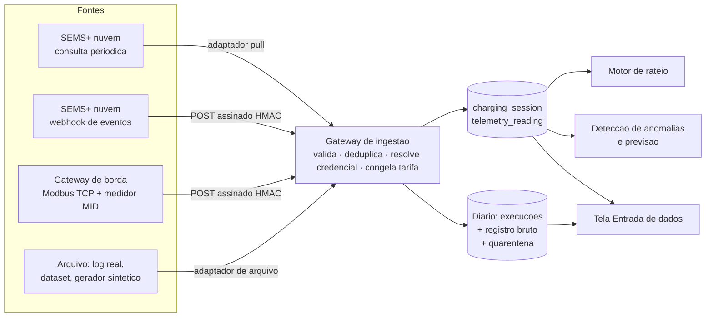

# Sprint 2: ingestão de dados e caminhos de integração com a GoodWe

> **O que este documento responde.** Como o dado do carregador chega ao EV ChargeOps, o que já está construído e testado para recebê-lo, e por quais caminhos a GoodWe poderia entregá-lo. Não sabemos como a GoodWe coleta, guarda ou pretende disponibilizar os dados dos carregadores, e é plausível que essa decisão ainda não esteja tomada. Em vez de esperar a resposta, a plataforma foi preparada para as três formas realistas de entrega, e este documento recomenda duas delas.

**Resumo em cinco linhas**

1. O back-end aceita o dado em três formatos de entrega: lote consultado (pull), eventos entregues (push por webhook assinado) e fluxo de um gateway de borda. Os três passam pelo mesmo gateway e saem no mesmo formato.
2. A ingestão é idempotente, tolera evento repetido e fora de ordem, isola falha por registro e guarda em quarentena reprocessável tudo o que recusa. Cada garantia tem um teste com o nome da garantia.
3. O primeiro dado real atravessou o pipeline: as 18 sessões do HCA G2 do laboratório da FIAP (136,66 kWh). Todas chegaram sem dono, porque o carregador operava em partida automática.
4. Recomendamos dois caminhos melhores que a consulta periódica à nuvem: **eventos por webhook com pull de reconciliação** (curto prazo, custo baixo para a GoodWe) e **gateway de borda Modbus com medidor MID** (onde a cobrança exigir lastro metrológico).
5. O problema mais importante que o dado real revelou não é de transporte. É de identidade: qualquer arquitetura que não entregue quem iniciou a recarga produz energia sem dono.

## Método

Três níveis de evidência, mantendo a convenção dos dossiês da Sprint 1:

- **Verificado no código.** Toda afirmação sobre o que a plataforma faz aponta para um arquivo e para um teste em `app/ingestion/tests/`. A suíte roda com `uv run pytest` (100 testes).
- **Verificado na Sprint 1.** O que se afirma sobre o HCA G2 e o SEMS+ vem dos dossiês já entregues, que citam fonte primária: [`frente-2-regulatorio.md`](frente-2-regulatorio.md) (datasheet e manual G2 V1.5) e [`frente-2-sems-plus-acesso.md`](frente-2-sems-plus-acesso.md) (observação direta da plataforma, nível [O]). Nenhuma fonte nova é citada aqui.
- **Inferência da equipe.** As arquiteturas propostas são desenho nosso. Não tivemos acesso ao mapa de registradores Modbus do HCA G2 nem à OpenAPI de desenvolvedor do SEMS. Onde uma proposta depende de algo que não pudemos verificar, o texto diz.

## 1. O que está pronto para receber o dado

Nenhuma caixa à direita do gateway conhece a fonte. Essa era a tese da Sprint 1; a diferença é que agora ela vale para os formatos de entrega que uma integração real usa, e não só para arquivo.

| Garantia | Onde mora | Teste que a prova |
|---|---|---|
| Reentregar não duplica cobrança. Chave preferida: id da fonte. Chave de reserva: ponto + início, com tolerância de 120 s entre relógios de fontes diferentes. As duas são `UNIQUE` no Postgres, então a corrida entre duas entregas simultâneas perde no banco | `ingestion/gateway.py`, `core/models.py` | `test_reingestao_do_mesmo_payload_nao_duplica`, `test_chave_natural_e_garantida_pelo_banco_e_nao_so_pelo_codigo` |
| Sessão que chega em andamento é encerrada pela entrega seguinte, e a tarifa congela no encerramento | `gateway._update_existing` | `test_sessao_em_andamento_e_encerrada_pela_entrega_seguinte` |
| Um registro malformado não derruba o lote. Cada registro roda no próprio savepoint | `gateway.process` | `test_um_registro_torto_nao_derruba_os_outros` |
| Nada é perdido em silêncio. Todo registro vira `RawEvent` com o payload original e o desfecho. O recusado é reprocessado depois de corrigida a causa | `ingestion/models.py`, `ingestion/replay.py` | `test_carregador_desconhecido_vai_para_quarentena_e_volta_no_replay` |
| Eventos fora de ordem e repetidos montam uma sessão só | `ingestion/adapters/events.py` | `test_eventos_fora_de_ordem_e_repetidos_montam_uma_sessao_so`, `test_fim_que_chega_antes_do_inicio_espera_e_se_resolve` |
| A mesma recarga descrita por duas fontes é uma sessão, e prevalece a medição de maior lastro: medidor MID, depois Modbus local, depois nuvem | `gateway.SOURCE_RANK` | `test_mesma_sessao_por_duas_fontes_nao_cobra_duas_vezes` |
| Fatura fechada não é reescrita nem pela própria ingestão. Correção tardia da fonte vira conflito para decisão humana | `gateway._update_existing` | `test_fatura_fechada_nao_e_reescrita_por_correcao_tardia_da_fonte` |
| Consulta incremental por marca d'água: só o que é novo desde a última execução | `IngestionRun.cursor_after` | `test_pull_incremental_so_traz_o_que_e_novo` |
| Webhook autenticado por HMAC-SHA256 do corpo, com segredo por fonte. Fonte sem segredo configurado fica desligada | `ingestion/views.py` | `test_push_assinado_entra_e_assinatura_errada_nao`, `test_push_de_fonte_sem_segredo_configurado_fica_desligado` |
| O endpoint recusa o LOTE antes de abrir execução no diário: método que não é POST (405), corpo que não é o contrato (400) e lote acima de 5.000 eventos (413). Lixo DENTRO de um lote legível é outro caso: responde 200 e vai para a quarentena | `ingestion/views.py` | `test_push_so_aceita_post`, `test_push_com_corpo_ilegivel_responde_400_e_nao_abre_execucao`, `test_push_acima_do_limite_responde_413_sem_ingerir_nada`, `test_push_com_lixo_responde_200_e_guarda_o_lixo` |
| Sessão de mês já fechado que aparece depois (órfã vinculada, entrega atrasada) entra na próxima fatura, identificada | `billing/engine.late_sessions` | `test_recarga_sem_dono_ganha_dono_e_entra_na_proxima_fatura` |

A fronteira entre a ingestão e a IA é explícita: **o gateway recusa o que é impossível de armazenar; o detector sinaliza o que é implausível.** Sessão de 0 kWh entra. Sessão de 90 kWh num carro de 40 entra, e a detecção a pega. Sessão que termina antes de começar não entra.

### O que o dado real ensinou

As 18 sessões do HCA G2 (SN 57000HPA247L0002) observadas no SEMS+ entram por `manage.py ingest semsplus_log`, ou pela primeira etapa do `manage.py pipeline`. São observação da tela da plataforma, nível [O], e não resposta de API autenticada. Os números são reais; o formato de transporte ainda não é o definitivo. Quatro coisas que dado sintético não ensinaria:

1. **A fonte não reporta medidor acumulado**, só início, fim e energia. O modelo canônico exigia `meter_start`. Era premissa nossa, não propriedade dos carregadores, e virou opcional. Junto foi corrigida a confusão entre "a fonte não informa medidor" e "a leitura final se perdeu", que reteria para sempre a fatura de todo morador.
2. **Todas as sessões chegaram sem dono.** O "ID do cartão" é o próprio número de série: assinatura de partida automática. São R$ 99,11 de energia que o condomínio pagaria na conta de luz sem ter de quem cobrar.
3. **Ausência de dado não é zero.** Sem potência informada, a primeira rodada do Isolation Forest acusou 17 das 18 recargas reais de "potência zero". A fase 2 da detecção passou a se abster sem telemetria, como a regra de ociosidade já fazia.
4. **Sessão de 0 kWh existe** (37 minutos conectado, nenhuma energia). Entra como veio.

## 2. O contrato que a plataforma pede

Independentemente do transporte, é isto que precisa chegar. A coluna da direita diz o que acontece quando o campo falta.

| Campo | Obrigatório | Se faltar |
|---|---|---|
| Número de série do carregador | sim | registro recusado |
| Início da sessão, com fuso | sim | registro recusado |
| Fim da sessão, com fuso | para sessão encerrada | sessão permanece em andamento |
| Energia da sessão (kWh) | sim, ou medidor inicial e final | registro recusado |
| Identificador de quem iniciou (cartão ou conta) | **sim, na prática** | sessão entra órfã, fora do rateio |
| Id da sessão na fonte | recomendado | deduplicação cai para ponto + início |
| Medidor acumulado inicial e final | recomendado | sem conferência de consistência do medidor |
| Potência e estado ao longo da sessão | recomendado | detecção de ociosidade e degradação se abstém |
| Motivo de encerramento (vocabulário OCPP) | opcional | fatura não explica interrupção |
| Origem da medição (nuvem, Modbus local, medidor MID) | opcional | assume nuvem, o menor lastro |

O formato de evento completo, com exemplo, está no cabeçalho de `app/ingestion/adapters/events.py`.

## 3. Três formas de entrega

### A. Consulta periódica à nuvem (pull)

A plataforma pergunta ao SEMS, de tempos em tempos, "o que encerrou desde a última vez". É o que a documentação comunitária e a nossa observação sugerem ser possível hoje: o endpoint `queryChargeLogList` existe e devolve sessões encerradas por intervalo de datas.

- **O que a GoodWe precisa fazer:** liberar credencial de API para o endpoint de histórico de recarga. Nenhum desenvolvimento novo.
- **O que o condomínio precisa:** nada além do carregador com internet.
- **Limites:** latência de minutos a horas; só sessões encerradas, sem telemetria durante a recarga; cada integrador consultando cada planta gera carga de polling na nuvem da GoodWe; o número é "de nuvem", sem lastro metrológico.
- **Como o back-end atende:** `SemsStubAdapter` com marca d'água. No dia da credencial, mudam as dez linhas de `_load`.

É o piso. Funciona, mas não diferencia.

### B. Eventos por webhook, com pull de reconciliação (recomendada para o curto prazo)

A nuvem da GoodWe **avisa** a plataforma quando algo acontece: sessão iniciada, leitura periódica, sessão encerrada, mudança de estado. A plataforma expõe um endpoint; a GoodWe faz um POST assinado.

A observação da Sprint 1 sustenta que a peça difícil já existe do lado deles: o SEMS+ mantém um canal SSE de notificações em tempo real para o próprio front-end (`/sse/subscribe/{userId}`). Inferência da equipe: quem já produz o evento internamente está a um despachante de webhooks de entregá-lo a integradores.

- **O que a GoodWe precisa fazer:** um cadastro de assinantes (URL + segredo por integrador) e um despachante com reenvio. É desenvolvimento, mas é o padrão de mercado para integração e serve a todos os parceiros de uma vez.
- **O que o condomínio precisa:** nada.
- **Ganhos sobre A:** tempo quase real, o que habilita o que o pull não permite (avisar que o carro terminou de carregar e está segurando a vaga); carga de rede proporcional aos eventos, e não ao número de integradores consultando.
- **O ponto fraco e a resposta:** webhook perde evento (endpoint fora do ar, reenvio esgotado). Por isso a recomendação é B **com** A: um pull diário de reconciliação recupera o que faltou. Isso só é seguro porque a ingestão é idempotente, e a sobreposição das duas vias vira "duplicata", não cobrança em dobro.
- **Segurança:** assinatura HMAC-SHA256 do corpo, segredo por fonte, comparação em tempo constante. Reenvio malicioso de um lote antigo é inofensivo pela mesma idempotência.
- **Como o back-end atende:** `POST /api/v1/ingest/<fonte>/` está implementado e testado. Responde 200 mesmo com registros recusados, que vão para a quarentena e vêm discriminados na resposta; responder 4xx faria a fonte reenviar para sempre um lote que nunca vai passar.

### C. Gateway de borda: Modbus TCP na garagem, com medidor MID (recomendada onde a cobrança exigir lastro)

Um equipamento pequeno na rede local da garagem lê o HCA G2 por Modbus TCP, o único protocolo que o datasheet declara, monta as sessões localmente e as envia à plataforma pelo mesmo endpoint de eventos de B. O manual do G2 registra que as portas RS-485 servem para comunicação com inversores e com **medidores MID**; o mesmo gateway lê esse medidor e marca a sessão como `mid_meter`.

- **O que a GoodWe precisa fazer:** publicar o mapa de registradores Modbus do HCA G2. Nenhum desenvolvimento de nuvem.
- **O que o condomínio precisa:** o gateway (um computador industrial de placa única), instalação e, para lastro metrológico, o medidor.
- **Ganhos:** independência da nuvem e da API do fabricante; funciona com a internet do prédio fora do ar, guardando eventos e reenviando depois (o que o back-end aceita, porque tolera atraso e repetição); medição com lastro. A Frente 2 registrou que a Lei municipal 17.336/2020 exige, nos edifícios novos de São Paulo, medição individualizada e cobrança da energia consumida, e concluiu que, num rateio contestável em assembleia, "medição certificada vale mais que número de API". A lei pede medição individualizada, não certificada: os três caminhos a atendem. O que só este caminho acrescenta é o lastro para defender o número quando alguém o contestar.
- **Limites, com franqueza:** custo e manutenção por condomínio; superfície de segurança de um equipamento na garagem. E o que não pudemos verificar: **não sabemos se o registrador Modbus expõe o identificador do cartão RFID.** Se não expuser, a borda entrega medição sem identidade.
- **Por que isso não invalida o caminho:** a plataforma já funde duas fontes que descrevem a mesma recarga. A nuvem diz quem; a borda diz quanto, com lastro. `test_mesma_sessao_por_duas_fontes_nao_cobra_duas_vezes` exercita exatamente essa combinação, inclusive a regra de que a medição MID substitui a de nuvem, e a de que nunca substitui o que já foi faturado.

### O destino: OCPP nativo

As três formas acima são pontes. O destino, que depende do roteiro de firmware da GoodWe e está fora do nosso alcance, é o carregador falar OCPP. O ganho que nenhuma ponte dá é o sentido inverso: a **plataforma autoriza** a recarga antes de ela começar. Isso elimina a sessão órfã na origem e permite suspender credencial por decisão de assembleia. O modelo interno já nasceu no vocabulário OCPP por decisão da Sprint 1, então esse dia não exige migração: exige mais um adaptador.

## 4. Comparação

| | A. Pull da nuvem | B. Webhook + pull | C. Borda Modbus + MID |
|---|---|---|---|
| Esforço da GoodWe | liberar credencial | construir despachante de eventos | publicar mapa de registradores |
| Custo por condomínio | nenhum | nenhum | equipamento, instalação, medidor |
| Latência | minutos a horas | segundos | segundos |
| Telemetria durante a recarga | não | sim | sim |
| Funciona sem internet no prédio | não | não | sim, com reenvio posterior |
| Lastro metrológico | não | não | sim |
| Identifica quem carregou | se a nuvem informar | se a nuvem informar | incerto; resolvido combinando com a nuvem |
| Estado no back-end | adaptador pronto, falta credencial | endpoint pronto e testado | endpoint pronto; falta o software da borda |

## 5. Análise da equipe

**A recomendação é uma sequência, não uma escolha.** B primeiro, porque custa pouco para a GoodWe, nada para o condomínio, e destrava o que o produto tem de mais visível, que é agir durante a recarga. C onde o condomínio for cobrar com rigor de medição ou onde a assembleia exigir independência do fabricante. A permanece como rede de segurança das duas. A ordem importa porque cada passo se paga sozinho e nenhum é desperdiçado quando o seguinte chega: o back-end é o mesmo.

**O achado que muda a conversa é o da identidade.** Entramos na Sprint 2 tratando a integração como problema de transporte. O dado real mostrou outro gargalo: 18 de 18 sessões sem dono, não por falha de rede, e sim porque o carregador estava em partida automática, um dos três métodos que o datasheet oferece. Para uso doméstico, é o modo certo. Para uso compartilhado, transforma toda recarga em custo do condomínio. A pergunta mais útil que podemos levar à GoodWe não é "qual API vocês vão abrir?", e sim "existe um modo de operação em que a partida automática fica desabilitada e todo início de sessão exige cartão ou app?". Se existir, é configuração. Se não existir, é o requisito de produto que separa um wallbox residencial de um carregador de condomínio. Enquanto isso, a plataforma trata o caso em vez de escondê-lo: a sessão órfã fica visível, com o valor em reais, e o gestor atribui dono a cada recarga sem apagar o que o equipamento reportou.

**O que a robustez custou.** O esquema de domínio continua com as 14 entidades da Frente 3. A ingestão ganhou duas tabelas operacionais (diário de execuções e registro bruto) que não descrevem o condomínio, e sim o que aconteceu na porta de entrada. `charging_session` ganhou dois campos de proveniência e uma restrição de unicidade. A aposta da Sprint 1, de que o esquema aguentaria o dado real sem entidade de emergência, segue ganha, com uma correção honesta: um campo que julgávamos universal, o medidor inicial, não era.

## 6. Limites declarados

- O dado real é de observação de tela, não de API. O formato do transporte definitivo é desconhecido, e é por isso que o mapeamento de campos está isolado do transporte em cada adaptador.
- O caminho C não foi exercitado contra hardware. O endpoint que o receberia está testado; o software do gateway de borda não existe, e o mapa de registradores do HCA G2 não é público.
- O endpoint de push roda em ambiente de desenvolvimento. Exposição à internet exige TLS, limite de taxa e rotação de segredo, que são decisões de implantação e não estão neste repositório.
- A tolerância de 120 s entre relógios de fontes diferentes é premissa da equipe. Dado real de duas fontes simultâneas pode pedir outro valor.
